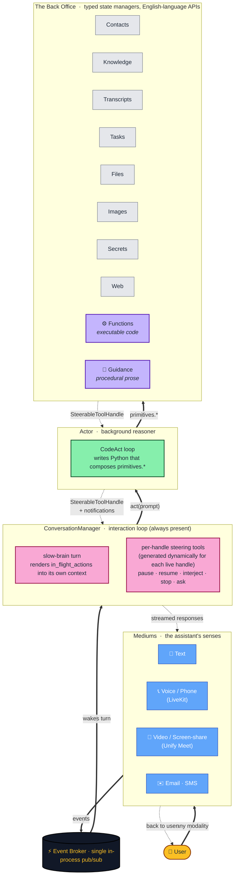
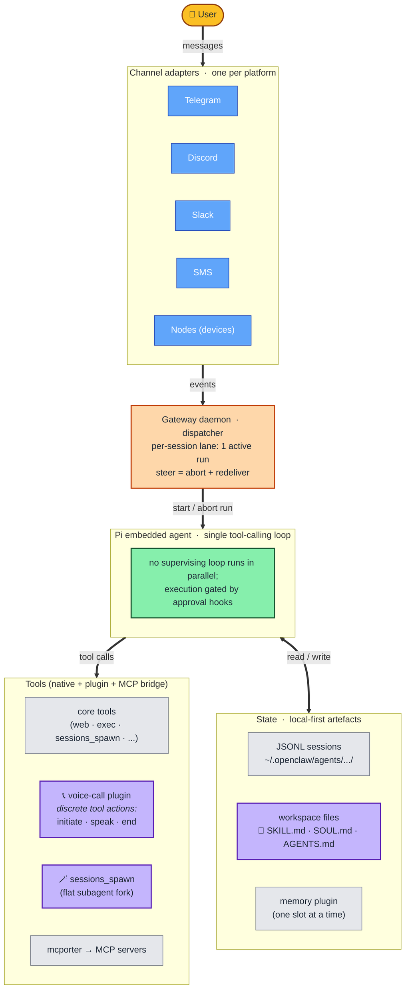
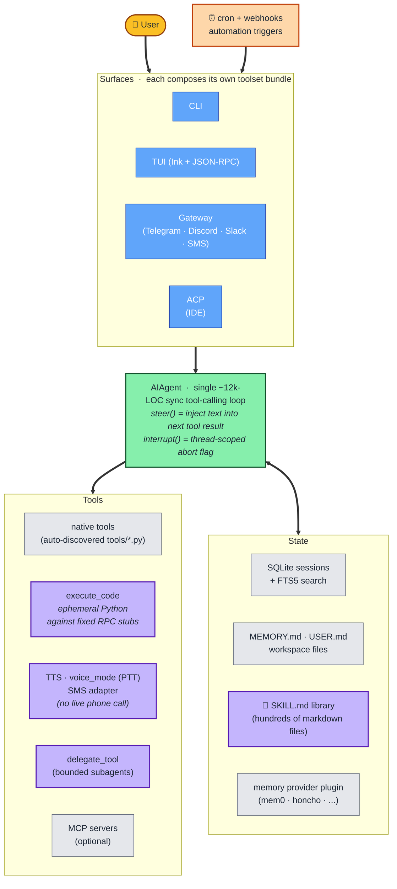

<p align="center">
  
</p>

<p align="center">
  <a href="LICENSE"></a>
  <a href="https://docs.unify.ai/basics/overview"></a>
  <a href="https://github.com/unifyai/unity/actions"></a>
  <a href="https://discord.com/invite/sXyFF8tDtm"></a>
  <a href="https://unify.ai"></a>
</p>

# Unity

**Open-source virtual teammates that take voice and video calls — and let you interrupt, redirect, or pause them mid-task without restarting.**

Hop on a call with one. Send a follow-up text. Drop them a calendar invite. They remember who you are next time, what you talked about last week, and what they promised to do about it.

Most agents stop the moment you talk. They make you wait for a tool call to finish, then re-explain when you change your mind. Unity's teammates stay listening through everything — chat, voice, phone, video, screen-share — and treat your interjections, corrections, and questions as first-class inputs rather than interruptions to recover from. Whether the assistant is researching flights, drafting an email, or sitting on a live call with a vendor, you can ask *"how's it going?"*, say *"actually do X instead"*, or pause for ten minutes — without losing context.

It's built around long-lived state, not one-shot conversations. Contacts, projects, files, knowledge, and follow-ups persist as queryable structure — so a teammate remembers who Sarah is, what the Henderson project is about, and what they committed to on your behalf last Wednesday, regardless of which channel you raised it on.

> **Start here:** [console.unify.ai](https://console.unify.ai) — try a teammate in 60 seconds • [Overview](https://docs.unify.ai/basics/overview) • [Quickstart](https://docs.unify.ai/basics/quickstart) • [ARCHITECTURE.md](ARCHITECTURE.md)

---

## What this feels like

```text
You          ▸  "Find me flights to Tokyo for next month."
Unity        ▸  (starts searching)
You          ▸  "Actually, also check trains to Osaka."
Unity        ▸  (adjusts the in-flight search — doesn't restart)
You          ▸  "Pause that, something urgent."
Unity        ▸  (freezes exactly where it is)
... five minutes later ...
You          ▸  "OK, resume. How's it going?"
Unity        ▸  (picks up where it left off, gives you a status update)
```

```text
Unity        ▸  (on a live phone call with a vendor)
You          ▸  (in a side chat) "Don't agree to anything over $5k."
Unity        ▸  (the constraint reaches the call mid-conversation)
```

```text
Unity        ▸  Three tasks running at once.
                  [0] research_flights   ██████████░░░  in progress
                  [1] draft_summary      ████████████░  in progress
                  [2] find_restaurants   ██░░░░░░░░░░  starting
                Each one independently inspectable, steerable, and pausable.
```

---

## Highlights

<table>
<tr><td><b>🎙️ Takes calls like a person</b></td><td>Live voice, phone, and video calls — with screen-share and webcam frames streamed to the assistant in real time. Not a tool that initiates a call; a participant in the conversation.</td></tr>
<tr><td><b>✋ Interruptible mid-task</b></td><td>Every operation can be paused, resumed, redirected, or queried while it's running. Including operations <i>nested inside other operations</i>, all the way down.</td></tr>
<tr><td><b>🧠 Plans in code, not tool-by-tool</b></td><td>Multi-step work becomes one coherent program with variables, loops, and control flow — instead of a noisy chain of one-tool-at-a-time decisions.</td></tr>
<tr><td><b>📞 One identity across every channel</b></td><td>Chat, SMS, email, phone, voice, video — all feed the same persistent memory. The assistant remembers who Sarah is whether she texted, called, or mailed you.</td></tr>
<tr><td><b>📚 Structured memory, not transcript soup</b></td><td>Contacts, knowledge, tasks, files, and procedures live in typed, queryable tables — distilled from your conversations every fifty messages.</td></tr>
<tr><td><b>⚙️ Learns reusable functions, not just markdown</b></td><td>After a successful trajectory, the assistant can save executable Python (with metadata and a venv) — so the next session can compose it into a plan, not re-derive it.</td></tr>
<tr><td><b>🔀 Concurrent work, independently steerable</b></td><td>Multiple actions can run at once. Pause one, redirect another, ask a third for a status update — without affecting the rest.</td></tr>
<tr><td><b>⏰ Schedules and triggers in plain English</b></td><td><i>"Every Monday at 9, summarize my unread emails"</i> or <i>"Ping me whenever Alice emails about invoices."</i> Recurring jobs and event triggers are described in natural language, executed by the same agent loop — and can graduate into stored functions after enough successful runs.</td></tr>
<tr><td><b>🔌 Local-first, fully open</b></td><td>Runtime, persistence backend, LLM client, and Python SDK are all open-source and run locally with one Docker command. Hosted backend optional.</td></tr>
</table>

---

## Try one

There are two paths, depending on whether you want to *meet a teammate* or *run the whole stack yourself*.

### 🌐 Hosted — fastest

The lowest-friction path is the hosted product at **[console.unify.ai](https://console.unify.ai)**. Sign in with Google, get matched with a teammate, and start chatting in about a minute. No install, no Docker, no API keys to manage. Voice, video, telephony, and integrations are all turn-key.

### 💻 Self-host — fully open

Run the whole stack on your own machine. Runtime, persistence backend, LLM client, and Python SDK are all open-source — see [Self-host](#self-host) below.

**No signup required.** The local installer auto-generates a synthetic API key for the bundled Orchestra and wires everything together. The only key you bring is one LLM provider key (OpenAI or Anthropic).

---

## Self-host

By default, Unity's open-core install is fully local: the runtime, the LLM client, and the persistence backend ([Orchestra](https://github.com/unifyai/orchestra), via Docker) all run on your machine. The hosted product at [console.unify.ai](https://console.unify.ai) is optional — Unity does not depend on it for any local feature.

**Prerequisites:**

- **Python 3.12+** (the installer will fetch it with `uv` if needed)
- **Docker** (runs the local Orchestra backend)
- **PortAudio** for audio support
  - macOS: `brew install portaudio`
  - Ubuntu/Debian: `sudo apt-get install portaudio19-dev python3-dev`
- **One LLM provider key** — [OpenAI](https://platform.openai.com/api-keys) or [Anthropic](https://console.anthropic.com/) are the simplest paths

**Install:**

```bash
curl -fsSL https://raw.githubusercontent.com/unifyai/unity/main/scripts/install.sh | bash
```

The installer clones `unity`, `unify`, `unillm`, and `orchestra` as siblings under `~/.unity/`, installs dependencies, creates a `unity` CLI shim in `~/.local/bin/`, boots a local Orchestra in Docker, **generates a local API key for the bundled Orchestra**, and wires `ORCHESTRA_URL` and that auto-generated key into `~/.unity/unity/.env`. No Unify account or external signup is required.

Add one model provider key to `~/.unity/unity/.env`:

```bash
OPENAI_API_KEY=sk-...
# or
ANTHROPIC_API_KEY=...
```

**Run the sandbox:**

```bash
unity --project_name Sandbox --overwrite
```

At the configuration prompt:

| Option | What it gives you |
|------|------|
| `1` | Top-level orchestration only — useful for isolating the conversation layer |
| `2` | The full runtime: orchestration + planning + simulated managers |
| `3` | Option 2 plus desktop/browser control through `agent-service` |

If you're evaluating Unity as a runtime, start with **option 2**.

```text
> msg Hey, can you help me organize my upcoming week?
> sms I need to reschedule my meeting with Sarah to Thursday
> email Project Update | Here are the Q3 numbers you asked for...
```

Other `unity` subcommands: `unity setup`, `unity status`, `unity stop`, `unity restart`, `unity help`.

<details>
<summary>Skip the local Orchestra (point at your own deployment)</summary>

```bash
curl -fsSL https://raw.githubusercontent.com/unifyai/unity/main/scripts/install.sh | bash -s -- --skip-setup
```

That leaves the code installed but doesn't spin up Orchestra. You'll need to point Unity at your own Orchestra deployment (or another team's shared one) via `ORCHESTRA_URL` and a matching API key in `~/.unity/unity/.env`.

</details>

<details>
<summary>Manual install (no installer script)</summary>

```bash
git clone https://github.com/unifyai/unity.git      ~/.unity/unity
git clone https://github.com/unifyai/unify.git      ~/.unity/unify
git clone https://github.com/unifyai/unillm.git     ~/.unity/unillm
git clone https://github.com/unifyai/orchestra.git  ~/.unity/orchestra

cd ~/.unity/unity
curl -LsSf https://astral.sh/uv/install.sh | sh
uv sync

cd ~/.unity/orchestra
poetry install
ORCHESTRA_INACTIVITY_TIMEOUT_SECONDS=0 scripts/local.sh start
# Copy the ORCHESTRA_URL and UNIFY_KEY it prints into ~/.unity/unity/.env
```

</details>

The installer copies `.env.example` to `.env` (intentionally minimal). For voice mode, live calls, hosted comms, LiveKit, Tavily, or visual caching, see `.env.advanced.example` and [`sandboxes/conversation_manager/README.md`](sandboxes/conversation_manager/README.md).

---

## How it works

Unity follows the **interaction-model / background-model** split [recently articulated by Thinking Machines](https://thinkingmachines.ai/blog/interaction-models/) — implemented at the harness level, against any LLM you already use.

A persistent **interaction loop** (the `ConversationManager`) stays present with the user across every medium. When work needs deeper reasoning than the conversation can produce instantly, it dispatches a **background reasoner** (the `Actor`), which writes Python plans over a back office of typed state managers. Crucially, **every operation in the system returns a live, steerable handle** — and those handles nest. A correction the user makes in chat propagates *down* through the dispatched action, into whatever manager call is currently running.



**Solid arrows** are dispatch flow. **Dotted arrows** are the *steering bus* — every level returns the same `SteerableToolHandle` type, so steering signals propagate down through the call stack while results and notifications propagate up.

### Why this matters: nested steering in action

This is the demo no other framework can run. The user's mid-flight redirect doesn't abort the run, doesn't append a second prompt, and doesn't wait for the next tool boundary — it propagates through the live nested call stack as a typed signal.

```mermaid
sequenceDiagram
    autonumber
    actor User
    participant CM as ConversationManager
    participant Actor
    participant TM as TranscriptManager

    User->>CM: "find when Sarah last mentioned Berlin"
    CM->>Actor: act(prompt)
    activate Actor
    Actor-->>CM: handle_A (SteerableToolHandle)
    Note over CM: handle_A stored in<br/>in_flight_actions
    Actor->>TM: transcripts.ask(...)
    activate TM
    TM-->>Actor: handle_B (nested SteerableToolHandle)

    User->>CM: "actually include emails too"
    Note over CM: slow brain wakes,<br/>picks the steering tool<br/>for handle_A
    CM->>Actor: handle_A.interject("...also emails")
    Actor->>TM: handle_B.interject("...also emails")
    TM-->>Actor: refined results
    deactivate TM
    Actor-->>CM: notification (intermediate progress)
    CM-->>User: "scanning emails too..."
    Actor-->>CM: handle_A.result
    deactivate Actor
    CM-->>User: final answer
```

---

## How does this compare to other open-source agents?

The clearest way to see what's distinctive about Unity is to draw the same diagram for adjacent projects, using the same visual language. **Pink** means *persistent supervising loop*. **Black** means *unified event broker*. Click to expand.

<details>
<summary><b>OpenClaw</b> — channel-first dispatcher + single Pi agent loop</summary>



OpenClaw is a local-first control plane with a wide channel matrix and a plugin marketplace. The Gateway *dispatches* runs but doesn't supervise them; voice is a plugin tool the agent invokes through discrete actions; steering is implemented as abort-and-redeliver. OpenClaw's `VISION.md` explicitly takes "no agent-hierarchy frameworks (manager-of-managers)" as a non-goal — a deliberate, principled bet in the opposite direction from Unity. If you want a personal-assistant **product** with broad channel coverage, OpenClaw is excellent. If you want a runtime built around mid-task steering and structured long-lived state, Unity is shaped differently.

</details>

<details>
<summary><b>Hermes Agent</b> — many surfaces, one monolithic loop</summary>



Hermes pairs a single ~12k-LOC `AIAgent` loop with four surfaces (CLI, TUI, gateway, ACP), a deep markdown skills library, SQLite+FTS5 transcripts, and best-in-class cron / webhook automation. Steering is implemented as text injection into the next tool result; interrupt is a thread-scoped flag. Live telephony isn't in the repo — SMS is, voice is local-only. If you want a polished personal-agent product with a wide messaging surface, broad model support, and mature automation triggers, Hermes is excellent. Unity is making a different bet on what the orchestration layer should look like.

</details>

> **A small bit of history.** This architecture has been running in Unity since 2025 — well ahead of the wider conversation about it. For the record:
>
> - **`SteerableToolHandle`** (the universal steering protocol) — first commit **September 23, 2025**. That predates OpenClaw's first commit (Nov 24, 2025), Hermes Agent's `interrupt()` (Feb 3, 2026) and `steer()` (Apr 18, 2026).
> - **`ConversationManager` + dual-brain LiveKit voice** — first commit **November 12, 2025**. That predates OpenClaw's `voice-call` plugin (Jan 11, 2026) by two months.
> - **The two-tier interaction-loop / background-reasoner pattern** as a whole — operational since November 2025. The Thinking Machines paper that articulated the same architecture was published **May 11, 2026**, six months later.
>
> We're not claiming foresight; the convergence is just interesting if you find architectural archaeology fun. Repo dates verifiable in `git log`.

---

## Under the hood

### Steerable handles — the universal protocol

Every public manager method returns one. The same `ask`, `interject`, `pause`, `resume`, `stop` surface, regardless of whether you're talking to the top-level orchestrator or a deeply nested knowledge query.

```python
handle = await actor.act("Research flights to Tokyo and draft an itinerary")

# Twenty seconds later, while it's still working:
await handle.interject("Also check train options from Tokyo to Osaka")

# Or if something urgent comes up:
await handle.pause()
# ... deal with the urgent thing ...
await handle.resume()
```

When the Actor calls `primitives.contacts.ask(...)`, the `ContactManager` starts its own tool loop and returns its own handle — nested inside the Actor's handle, which is nested inside the `ConversationManager`'s. Steering at any level propagates.

### CodeAct — the Actor writes Python programs

Most agents emit one JSON tool call at a time and let the LLM stitch results together across turns. Unity's Actor writes a single Python program per turn over typed `primitives.*`:

```python
contacts = await primitives.contacts.ask(
    "Who was involved in the Henderson project?"
)
for contact in contacts:
    history = await primitives.knowledge.ask(
        f"What was {contact} last working on?"
    )
    await primitives.contacts.update(
        f"Send {contact} a catch-up email referencing {history}"
    )
```

This runs in a sandboxed execution session. Variables, loops, real control flow. A contact lookup → knowledge retrieval → outbound communication becomes one coherent plan rather than three separate tool-selection turns — and the LLM can express intermediate computation directly instead of round-tripping through tool messages.

### Dual-brain voice and video

Live calls run as two coordinated brains:

- **Slow brain** — the `ConversationManager`. Sees the full picture: all conversations, in-flight actions, structured memory. Makes deliberate decisions. Runs in the main process.
- **Fast brain** — a real-time voice agent on LiveKit, running as a separate subprocess. Sub-second latency. Handles turn-taking and direct conversation autonomously.

They communicate over IPC. When the slow brain wants to guide the conversation, it sends one of:

- **SPEAK** — "say exactly this" (bypasses the fast brain's LLM)
- **NOTIFY** — "here's some context, decide what to do with it"
- **BLOCK** — nothing; the fast brain keeps going on its own

Screen-share frames and webcam frames stream to both brains simultaneously, so the fast brain can answer *"can you see my screen?"* without round-tripping, while the slow brain incorporates visual context into longer-running plans.

### Functions and Guidance — a dual library

Unity maintains two persistent libraries that the Actor draws from on every session:

- **`FunctionManager`** — executable Python (with metadata and a venv) that the Actor composes into plans.
- **`GuidanceManager`** — procedural how-to prose: SOPs, software walkthroughs, multi-step strategies.

After a successful trajectory, a proactive reviewer loop (`store_skills`) can extract *both* — code worth keeping, and the procedural narrative for using it. The next session consults both before reaching for raw tools, by design.

### Schedules and triggers, described in plain English

Recurring and triggered work isn't configured with cron expressions or webhook YAML — it's described to the agent in natural language and stored as a `Task` with `schedule` and `repeat` (for cadences) or `trigger` (for event matches). When the time arrives or the trigger fires, a contained `Actor` run wakes up, reads the task's description, and figures out how to do it.

That same task can graduate over time. After enough successful description-driven runs, the storage-review loop can persist the trajectory as a stored function — at which point the recurring task runs in a hidden, headless lane against that function rather than re-planning from scratch each time. So *"summarize my unread emails every Monday at 9"* starts out as a paragraph the agent interprets, and gradually becomes an entrypoint it just calls.

### Memory consolidation

Every fifty messages, the `MemoryManager` runs a background extraction pass over the new transcript window. It distills:

- **Contact profiles** — who people are, their roles, relationships
- **Per-contact summaries** — what you've been discussing, sentiment, themes
- **Response policies** — how each person prefers to be communicated with
- **Domain knowledge** — project details, preferences, long-term facts
- **Tasks** — things you committed to, deadlines, follow-ups

These end up in typed, queryable tables — not freeform transcript summaries.

### Concurrent steerable actions

```text
┌─ In-Flight Actions ────────────────────────────────┐
│                                                     │
│  [0] research_flights  ██████████░░░  In progress   │
│      → ask, interject, stop, pause                  │
│                                                     │
│  [1] draft_summary     ████████████░  In progress   │
│      → ask, interject, stop, pause                  │
│                                                     │
│  [2] find_restaurants   ██░░░░░░░░░░  Starting      │
│      → ask, interject, stop, pause                  │
│                                                     │
└─────────────────────────────────────────────────────┘
```

Each action gets its own dynamically-generated steering tools attached to the slow brain's tool surface. You can inspect, interject into, pause, resume, or stop one action without affecting the others.

---

## Architecture

For the full architectural breakdown — async tool loop internals, event bus, primitive registry, hosted deployment SPI — see [`ARCHITECTURE.md`](ARCHITECTURE.md). At a glance:

```text
ConversationManager (interaction loop, event-driven scheduling)
    │
    │   Slow Brain ◄── IPC ──► Fast Brain (real-time voice + video, LiveKit)
    │
    ▼
CodeActActor (generates Python plans, calls primitives.* APIs)
    │
    ▼
State Managers (each runs its own async LLM tool loop)
    │
    ├── ContactManager        — people and relationships
    ├── KnowledgeManager      — domain facts, structured knowledge
    ├── TaskScheduler         — durable tasks, schedules, triggers, execution with live handles
    ├── TranscriptManager     — conversation history and search
    ├── GuidanceManager       — procedures, SOPs, how-to knowledge
    ├── FileManager           — file parsing and registry
    ├── ImageManager          — image storage, vision queries
    ├── FunctionManager       — user-defined functions, primitives registry
    ├── WebSearcher           — web research orchestration
    ├── SecretManager         — encrypted secret storage
    ├── BlacklistManager      — blocked contact details
    └── DataManager           — low-level data operations
    │
    ├── EventBus              — typed pub/sub backbone (Pydantic events)
    └── MemoryManager         — offline consolidation every 50 messages
```

### How a request flows

1. A user message arrives on any medium. The slow brain renders a full state snapshot and makes a single-shot tool decision.
2. It starts an action via `actor.act(...)` → gets back a `SteerableToolHandle`, registered in `in_flight_actions`.
3. The Actor generates a Python plan calling typed primitives. Each primitive dispatches to a manager running its own LLM tool loop, returning its own steerable handle.
4. Meanwhile, the slow brain can start more work, steer existing work, or guide the fast brain during voice/video calls.
5. The MemoryManager observes message events and periodically distills conversations into structured knowledge.
6. The EventBus carries typed events with hierarchy labels aligned to tool-loop lineage, making everything observable.

---

## What's open and what isn't

Unity is the **open core** of the Unify platform. This repository contains the agent runtime: the managers, async tool loops, CodeAct actor, dual-brain voice coordination, event backbone, and memory consolidation.

The supporting infrastructure is open-source too: [Orchestra](https://github.com/unifyai/orchestra) (persistence, runs locally via Docker), [Unify](https://github.com/unifyai/unify) (Python SDK), and [UniLLM](https://github.com/unifyai/unillm) (provider-agnostic LLM client).

**Not open-sourced** is the managed platform layer around the runtime: hosted communication routing, telephony and SIP infrastructure, Microsoft 365 tenant integration, the assistant session control plane, the web dashboard ([console.unify.ai](https://console.unify.ai)), and identity. Features that depend on the managed platform layer only work against the hosted service.

A small note on the Orchestra source tree: it ships with Stripe and credits routines that exist for the hosted product. **They are dormant in local mode** — no external calls fire, no signups, no charges; the local install simply ignores them. They live in the same repo to keep one canonical persistence layer rather than fork it for self-hosting.

| Repo | Role |
|------|------|
| **unity** (this) | The agent runtime — managers, tool loops, CodeAct, voice, orchestration |
| **[orchestra](https://github.com/unifyai/orchestra)** | Persistence backend — FastAPI + Postgres + pgvector. Installer spins it up locally in Docker |
| **[unify](https://github.com/unifyai/unify)** | Python SDK — the client Unity uses to talk to Orchestra |
| **[unillm](https://github.com/unifyai/unillm)** | LLM access layer — OpenAI, Anthropic, or any compatible endpoint |

All MIT-licensed.

---

## Running the tests

Tests exercise the real system (steerable handles, CodeAct, manager composition, nested tool loops) against simulated backends with cached LLM responses:

```bash
uv sync --all-groups
source .venv/bin/activate

tests/parallel_run.sh tests/                    # everything
tests/parallel_run.sh tests/actor/              # one module
tests/parallel_run.sh tests/contact_manager/    # another
```

See [tests/README.md](tests/README.md) for the full philosophy — responses are cached, not mocked. Delete the cache and you're re-evaluating against live models.

---

## Where to start reading

| File | What's there |
|------|-------------|
| `unity/common/async_tool_loop.py` | `SteerableToolHandle` — the protocol everything returns |
| `unity/common/_async_tool/loop.py` | The async tool loop engine — nesting, steering, context propagation |
| `unity/actor/code_act_actor.py` | CodeAct — plan generation, sandbox, primitives |
| `unity/conversation_manager/conversation_manager.py` | Dual-brain orchestration, debouncing, in-flight actions |
| `unity/conversation_manager/domains/brain_action_tools.py` | How the brain starts, steers, and tracks concurrent work |
| `unity/conversation_manager/domains/call_manager.py` | LiveKit subprocess + voice/video event wiring |
| `unity/function_manager/primitives/registry.py` | How primitives are assembled into the typed API surface |
| `unity/events/event_bus.py` | Typed event backbone |
| `unity/memory_manager/memory_manager.py` | Offline consolidation pipeline |

---

## Project structure

```text
unity/
├── unity/
│   ├── actor/                    # CodeActActor
│   ├── conversation_manager/     # Dual-brain orchestration
│   │   └── domains/              # Brain tools, action tracking, rendering
│   ├── common/
│   │   ├── async_tool_loop.py    # SteerableToolHandle
│   │   └── _async_tool/          # Tool loop internals
│   ├── contact_manager/
│   ├── knowledge_manager/
│   ├── task_scheduler/
│   ├── transcript_manager/
│   ├── guidance_manager/
│   ├── memory_manager/
│   ├── function_manager/
│   ├── file_manager/
│   ├── image_manager/
│   ├── web_searcher/
│   ├── secret_manager/
│   ├── events/
│   └── manager_registry.py
├── sandboxes/                    # Interactive playgrounds
│   └── conversation_manager/     # Full ConversationManager sandbox (start here)
├── tests/
├── agent-service/                # Node.js desktop/browser automation
└── deploy/                       # Dockerfile, Cloud Build, virtual desktop
```

---

## Design principles

**No regex or substring matching for routing user intent.** Everything goes through LLM reasoning, guided by prompts and tool docstrings. If the system handles something wrong, we fix the prompt — not add a hardcoded rule.

**No mocked LLMs in tests.** Every test uses real inference, cached for speed. Delete the cache and you're re-evaluating against live models.

**No defensive coding.** No try/except around things that shouldn't fail. No null checks for things that shouldn't be null. The system fails loud when assumptions break.

**English as an API.** Managers communicate through natural-language interfaces. The Actor orchestrates through English-language primitives. The whole system stays inspectable without reading implementation code.

---

## License

MIT — see [LICENSE](LICENSE).

Built by the team at [Unify](https://unify.ai).
