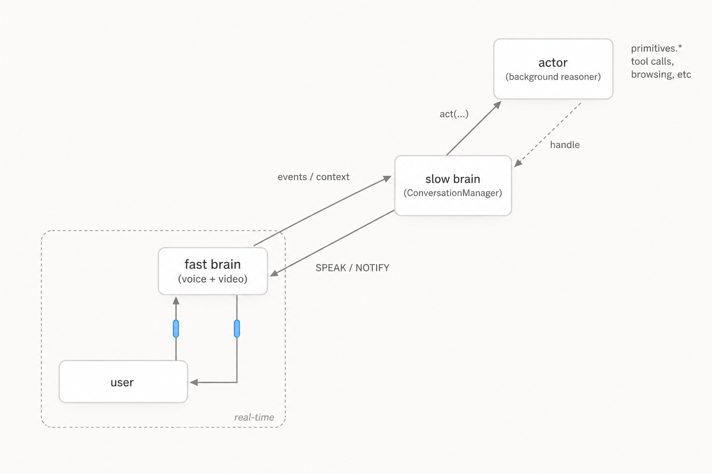

<p align="center">
  
</p>

<p align="center">
  <a href="LICENSE"></a>
  <a href="https://docs.unify.ai/basics/overview"></a>
  <a href="https://github.com/unifyai/unity/actions"></a>
  <a href="https://discord.com/invite/sXyFF8tDtm"></a>
  <a href="https://unify.ai"></a>
</p>

# Unity

**Open-source virtual teammates that take voice and video calls — and let you interrupt, redirect, or pause them mid-task without restarting.**

<p align="center">
  
</p>

Hop on a call with one. Send a follow-up text. Drop them a calendar invite. They remember who you are, what you talked about last week, and what they promised to do about it — across chat, voice, phone, video, and screen-share, and across your interjections, corrections, and pauses mid-task.

Contacts, knowledge, tasks, and procedures persist as queryable structure — so the assistant remembers who Sarah is, what the Henderson project is about, and what they committed to on your behalf last Wednesday. **You install Unity once. It lives on your laptop, accumulates state across every session, and is there when you come back.**

---

## Install

**Prerequisites:** Python 3.12+, Docker, and an LLM provider key (OpenAI or Anthropic). macOS, Linux, or WSL2.

```bash
curl -fsSL https://raw.githubusercontent.com/unifyai/unity/main/scripts/install.sh | bash
```

The installer prompts you inline for an OpenAI or Anthropic key and writes it into `~/.unity/unity/.env`. **Open a new terminal** (so the installer-added PATH entry takes effect), then run in two:

| Terminal 1 — chat | Terminal 2 — live logs |
|---|---|
| `unity` | `unity logs` |

That's it. You're chatting with a local assistant called `Unity`. State persists across runs *and* across reboots — Ctrl+C, come back tomorrow, `unity` again resumes from where you left off.

```text
> Hey, can you help me organize my upcoming week?
> Pull up everything we know about the Henderson account.
> Remind me to call Sarah on Thursday.
```

<details>
<summary>What the installer does</summary>

Clones `unity`, `unify`, `unillm`, and `orchestra-core` as siblings under `~/.unity/`. Installs Python dependencies with `uv`. Boots a local Orchestra in Docker. Generates a local API key for that bundled Orchestra. Writes `ORCHESTRA_URL`, `UNIFY_KEY`, and your LLM provider key into `~/.unity/unity/.env`. Creates a `unity` CLI shim in `~/.local/bin/` and appends a clearly-marked PATH block to your `~/.zshrc` / `~/.bash_profile` / `~/.bashrc`. No Unify account or signup is required.

If you skip the LLM key at install time (or pipe through a non-interactive shell), the installer prints the one line to add to `.env` manually.

</details>

<details>
<summary>Persistence across reboots</summary>

All long-lived state — transcripts, contacts, knowledge, tasks, functions, guidance — lives in Orchestra Postgres, which Unity stores in a Docker named volume (`orchestra-local-db-data`) with `--restart unless-stopped`. The moment the Docker daemon comes back after a reboot, the Postgres container auto-starts and re-attaches the volume; the next `unity` invocation auto-starts the Orchestra FastAPI server against the existing data. No state is lost, no `unity setup` re-run required.

The only piece outside Unity's install scope is whether Docker itself auto-starts at boot:

- **macOS** — Docker Desktop ships with *Start Docker Desktop when you log in* enabled by default (Settings → General). Nothing to do.
- **Linux** — enable the systemd unit once: `sudo systemctl enable docker`. `unity doctor` flags this when missing.

</details>

---

## Voice — talking to your assistant in the browser

The same install can also handle **real voice calls** locally: the production fast-brain (interruption-handling, telephony-aware) running against your local stack, with sub-second latency. Two-step setup, same two-terminal flow.

### Step 1 — one-time voice setup

```bash
unity voice setup
```

That installs `livekit-server` (a single binary, **no LiveKit Cloud account required** — the server runs locally bound to `127.0.0.1`), boots it in `--dev` mode, and writes `LIVEKIT_URL` / `LIVEKIT_API_KEY` / `LIVEKIT_API_SECRET` to `~/.unity/unity/.env`.

The only voice-related keys you bring yourself are speech-to-text and text-to-speech. Both providers have free tiers; pick **one** TTS provider:

| Variable | Purpose | Where to get it |
|---|---|---|
| `DEEPGRAM_API_KEY` | Speech-to-text | [console.deepgram.com](https://console.deepgram.com) — free tier |
| `CARTESIA_API_KEY` *or* `ELEVEN_API_KEY` | Text-to-speech (pick one) | [play.cartesia.ai](https://play.cartesia.ai) or [elevenlabs.io](https://elevenlabs.io) — free credits |

Add the chosen keys to `~/.unity/unity/.env`.

### Step 2 — run in two terminals

| Terminal 1 — chat + voice control | Terminal 2 — live logs |
|---|---|
| `unity --live-voice` | `unity logs` |

From the chat prompt: `call` opens the LiveKit Agents Playground in your browser — speak through your mic; `end_call` tears the room down. The first `call` clones [agents-playground](https://github.com/livekit/agents-playground) into `~/.livekit-playground/` and runs `npm install` (one-time; needs Node.js).

Stop voice with `unity voice stop`. Full voice configuration (voice ID, provider selection, SIP/phone numbers) lives in [`sandboxes/conversation_manager/README.md`](sandboxes/conversation_manager/README.md).

---

## The local assistant

The local install always runs **a single assistant called `Unity`**. There's no naming flow, no voice picker, no photo upload, no profile form, and no way to add more assistants locally — the runtime simply boots with `Unity` and that's who you talk to.

That's deliberate. The local deployment exists to demonstrate the runtime's design and to give anyone interested a complete, working starting point to fork or extend. The full multi-assistant product experience — multiple named teammates, custom voices and photos, real telephony, channel integrations, organisations, billing — lives in the hosted product at **[console.unify.ai](https://console.unify.ai)**.

---

## Day-to-day commands

```text
unity                       Start the runtime (full system on your laptop)
unity logs                  Tail the runtime log in a second terminal
unity --live-voice          Start the runtime with live voice calls in the browser
unity setup                 Bootstrap / re-bootstrap local Orchestra
unity status                Local Orchestra status
unity stop                  Stop local Orchestra (preserves data)
unity restart               Restart local Orchestra (preserves data)
unity doctor                Diagnose missing deps, keys, and PATH
unity update                git pull --rebase the four repos + uv sync
unity voice setup           Install + start local LiveKit
unity voice stop / status   Stop / report local LiveKit
unity help                  Subcommand reference
```

### Alternatives

- **Hosted product.** If you'd rather skip the install entirely, the hosted product at **[console.unify.ai](https://console.unify.ai)** lets you sign in with Google and chat with a teammate in about a minute — voice, video, telephony, and integrations are turn-key. The hosted backend runs as a separate private service; Unity does not depend on it for any local feature.
- **Point at your own backend.** `curl … install.sh | bash -s -- --skip-setup` installs the code without spinning up local Orchestra. Then point at your own Orchestra-compatible deployment via `ORCHESTRA_URL` + `UNIFY_KEY` in `~/.unity/unity/.env`.
- **Manual install.** Clone the four repos (`unity`, `unify`, `unillm`, `orchestra-core`) into `~/.unity/`, `uv sync` in `unity/`, then `scripts/local.sh start` in `orchestra-core/` with `ORCHESTRA_INACTIVITY_TIMEOUT_SECONDS=0`. Copy the printed `UNIFY_BASE_URL` and `UNIFY_KEY` into `~/.unity/unity/.env` as `ORCHESTRA_URL` and `UNIFY_KEY`.
- **Sandbox / evaluation mode.** The same codebase can run with simulated managers and mock computer backends for isolated component evaluation — see [`sandboxes/conversation_manager/README.md`](sandboxes/conversation_manager/README.md) for `--project_name`, `--overwrite`, `--real-comms` and the per-manager dev sandboxes under `sandboxes/`.

For everything you can put into `.env` beyond the basics — visual caching, Tavily, hosted comms — see `.env.advanced.example`.

---

## What this feels like

```text
You          ▸  "Find me flights to Tokyo for next month."
Unity        ▸  (starts searching)
You          ▸  "Actually, also check trains to Osaka."
Unity        ▸  (adjusts the in-flight search — doesn't restart)
You          ▸  "Pause that, something urgent."
Unity        ▸  (freezes exactly where it is)
... five minutes later ...
You          ▸  "OK, resume. How's it going?"
Unity        ▸  (picks up where it left off, gives you a status update)
```

```text
Unity        ▸  (on a live phone call with a vendor)
You          ▸  (in a side chat) "Don't agree to anything over $5k."
Unity        ▸  (the constraint reaches the call mid-conversation)
```

```text
Unity        ▸  Three tasks running at once.
                  [0] research_flights   ██████████░░░  in progress
                  [1] draft_summary      ████████████░  in progress
                  [2] find_restaurants   ██░░░░░░░░░░  starting
                Each one independently inspectable, steerable, and pausable.
```

---

## Highlights

<table>
<tr><td><b>🎙️ Takes calls like a person</b></td><td>Live voice, phone, and video calls — with screen-share and webcam frames streamed to the assistant in real time. Not a tool that initiates a call; a participant in the conversation.</td></tr>
<tr><td><b>✋ Interruptible mid-task</b></td><td>Every operation can be paused, resumed, redirected, or queried while it's running. Including operations <i>nested inside other operations</i>, all the way down.</td></tr>
<tr><td><b>🧠 Plans in code, not tool-by-tool</b></td><td>Multi-step work becomes one coherent program with variables, loops, and control flow — instead of a noisy chain of one-tool-at-a-time decisions.</td></tr>
<tr><td><b>📞 One identity across every channel</b></td><td>Chat, SMS, email, phone, voice, video — all feed the same persistent memory. The assistant remembers who Sarah is whether she texted, called, or mailed you.</td></tr>
<tr><td><b>📚 Structured memory, not transcript soup</b></td><td>Contacts, knowledge, tasks, files, and procedures live in typed, queryable tables — distilled from your conversations every fifty messages.</td></tr>
<tr><td><b>⚙️ Learns reusable functions, not just markdown</b></td><td>After a successful trajectory, the assistant can save executable Python (with metadata and a venv) — so the next session can compose it into a plan, not re-derive it.</td></tr>
<tr><td><b>🔀 Concurrent work, independently steerable</b></td><td>Multiple actions can run at once. Pause one, redirect another, ask a third for a status update — without affecting the rest.</td></tr>
<tr><td><b>⏰ Schedules and triggers in plain English</b></td><td><i>"Every Monday at 9, summarize my unread emails"</i> or <i>"Ping me whenever Alice emails about invoices."</i> Recurring jobs and event triggers are described in natural language, executed by the same agent loop — and can graduate into stored functions after enough successful runs.</td></tr>
<tr><td><b>🔌 Local-first, fully open</b></td><td>Runtime, persistence backend, LLM client, and Python SDK are all open-source and run locally with one Docker command. Hosted backend optional.</td></tr>
</table>

---

## How it works

Unity is organised around an **interaction loop / background reasoner** split — the same two-tier pattern recently articulated in [Thinking Machines' interaction-models post](https://thinkingmachines.ai/blog/interaction-models/). Thinking Machines puts the split *inside the model* (a single model trained to interact natively); Unity arrives at the same shape at the harness level, using the tools available today. When interaction-native models ship publicly, they would replace Unity's fast/slow-brain split end-to-end.

A persistent **interaction loop** (the `ConversationManager`) stays present with the user across every medium and keeps thinking while work is in flight — it doesn't go silent waiting for a tool to finish. When something needs deeper reasoning than the conversation can produce instantly, it dispatches a **background reasoner** (the `Actor`), which writes Python plans over a back office of typed state managers. Every operation in the system returns a live, steerable handle, and those handles nest: a correction the user makes in chat propagates *down* through the dispatched action, into whatever manager call is currently running.

<p align="center">
  
</p>

**Solid arrows** are dispatch flow. **Dotted arrows** are the *steering bus* — every level returns the same `SteerableToolHandle` type, so steering signals propagate down through the call stack while results and notifications propagate up.

### Why this matters: nested steering in action

The user's mid-flight redirect doesn't abort the run, doesn't append a second prompt, and doesn't wait for the next tool boundary — it propagates through the live nested call stack as a typed signal that any inner manager loop can choose to act on. This isn't something either of the adjacent open-source agent frameworks expose today.

<p align="center">
  
</p>

---

## Where Unity sits in the open-source landscape

OpenClaw and Hermes Agent are excellent — both are mature personal assistants with wide messaging surfaces, large contributor communities, and well-trodden install paths. Unity is making a different architectural bet, and the easiest way to see it is to draw all three using the same visual language: identical panel, identical box and arrow grammar, identical colour semantics. Every visual difference between the three diagrams below maps to a real architectural difference; nothing is stylistic.

The colour palette is locked across all three diagrams and means exactly one thing each:

- **Green** — the agent's tool-calling loop (the loop that actually calls tools to do work). Every assistant has one; every diagram has exactly one green box.
- **Peach** — an autonomous wake source: a non-user input that can cause the agent to think without a fresh user message. Every assistant has one; the *label* encodes the mechanism (cron + webhooks vs. natural-language scheduled Tasks vs. ...), but the *colour* is universal.
- **Pink** — a *persistent reasoning loop* above the agent: a layer that keeps reasoning while a dispatched action is in flight, distinct from a persistent process or daemon. This is the only colour whose presence varies across the family — and that's the headline architectural distinction the comparison exists to surface.
- **White** — passive structural tiers (channels / surfaces / mediums, tools, state, dispatcher daemon).

<details open>
<summary><b>Unity</b> — persistent reasoning loop above a supervised Actor, with a dual-brain conversation tier</summary>

<p align="center">
  
</p>

Unity puts a persistent reasoning loop (`ConversationManager`, pink) *above* the tool-caller, not next to it: the slow brain stays present and keeps reasoning while a dispatched action is in flight. Real-time voice and video are handled by a separate fast brain coordinated over IPC, so the slow brain can deliberate without blocking sub-second turn-taking. Below the slow brain, a separate `CodeActActor` tier writes one Python program per turn over typed `primitives.*` — supervised by the slow brain rather than left to free-run. Long-lived state is a back office of typed managers (contacts, knowledge, tasks, transcripts, ...), each with its own async tool loop and its own steerable handles, instead of opaque session/markdown files. Autonomous wake — recurring schedules and event triggers — is described in natural language and stored as `Task` rows; the `TaskScheduler` materialises these via external Cloud Tasks for cadences and inbound-communication filters for event matches, rather than an in-process cron daemon or generic HTTP-webhook listener.

</details>

<details>
<summary><b>OpenClaw</b> — channel-first dispatcher + single Pi agent loop</summary>

<p align="center">
  
</p>

OpenClaw is a local-first control plane with a wide channel matrix and a plugin marketplace. The Gateway *dispatches* runs onto a single Pi agent loop but doesn't supervise them; voice is a plugin tool the agent invokes through discrete actions. Autonomous wake — cron schedules, HTTP webhook ingress (`/hooks`), and Gmail Pub/Sub — runs as an in-process timer and HTTP server inside the Gateway daemon, dispatching isolated agent turns when due. New messages that arrive during a run are handled at turn boundaries — `interrupt` aborts the run, `steer`/`followup` enqueues for after the run — but there is no in-flight steering mechanism. OpenClaw's `VISION.md` explicitly takes "no agent-hierarchy frameworks (manager-of-managers)" as a non-goal — a principled bet in the opposite direction from Unity. If you want a personal-assistant **product** with broad channel coverage and a thriving plugin ecosystem, OpenClaw is excellent. Unity is shaped for a different brief: a runtime where every action is mid-flight steerable and long-lived state is structured.

</details>

<details>
<summary><b>Hermes Agent</b> — many surfaces, one monolithic loop</summary>

<p align="center">
  
</p>

Hermes pairs a single sync agent-loop (~12k-LOC across `AIAgent`, the conversation loop, and runtime helpers) with four surfaces (CLI, TUI, gateway, ACP), a deep markdown skills library, SQLite+FTS5 transcripts, and a strong cron + webhook automation subsystem (background thread inside the gateway process for schedules, aiohttp server for HTTP webhook ingress from GitHub/JIRA/Stripe/etc.). Steering is implemented as text injection into the next tool result; interrupt is a thread-scoped flag that propagates to delegated subagents. Live telephony isn't in the repo — SMS is, voice is local-only. If you want a polished personal-agent product with a wide messaging surface, broad model support, and mature automation triggers, Hermes is excellent. Unity is making a different bet on what the orchestration layer should look like — one in which the reasoning loop above the tool-caller is permanent, and steering is a first-class signal that nests through every manager call.

</details>

---

## Under the hood

### Steerable handles — the universal protocol

Every public manager method returns one. The same `ask`, `interject`, `pause`, `resume`, `stop` surface, regardless of whether you're talking to the top-level orchestrator or a deeply nested knowledge query.

```python
handle = await actor.act("Research flights to Tokyo and draft an itinerary")

# Twenty seconds later, while it's still working:
await handle.interject("Also check train options from Tokyo to Osaka")

# Or if something urgent comes up:
await handle.pause()
# ... deal with the urgent thing ...
await handle.resume()
```

When the Actor calls `primitives.contacts.ask(...)`, the `ContactManager` starts its own tool loop and returns its own handle — nested inside the Actor's handle, which is nested inside the `ConversationManager`'s. Steering at any level propagates.

### CodeAct — the Actor writes Python programs

Most agents emit one JSON tool call at a time and let the LLM stitch results together across turns. Unity's Actor writes a single Python program per turn over typed `primitives.*`:

```python
contacts = await primitives.contacts.ask(
    "Who was involved in the Henderson project?"
)
for contact in contacts:
    history = await primitives.knowledge.ask(
        f"What was {contact} last working on?"
    )
    await primitives.contacts.update(
        f"Send {contact} a catch-up email referencing {history}"
    )
```

This runs in a sandboxed execution session. Variables, loops, real control flow. A contact lookup → knowledge retrieval → outbound communication becomes one coherent plan rather than three separate tool-selection turns — and the LLM can express intermediate computation directly instead of round-tripping through tool messages.

### Dual-brain voice and video

Live calls run as two coordinated brains:

- **Slow brain** — the `ConversationManager`. Sees the full picture: all conversations, in-flight actions, structured memory. Makes deliberate decisions. Runs in the main process.
- **Fast brain** — a real-time voice agent on LiveKit, running as a separate subprocess. Sub-second latency. Handles turn-taking and direct conversation autonomously.

They communicate over IPC. When the slow brain wants to guide the conversation, it sends one of:

- **SPEAK** — "say exactly this" (bypasses the fast brain's LLM)
- **NOTIFY** — "here's some context, decide what to do with it"
- **BLOCK** — nothing; the fast brain keeps going on its own

Screen-share frames and webcam frames stream to both brains simultaneously, so the fast brain can answer *"can you see my screen?"* without round-tripping, while the slow brain incorporates visual context into longer-running plans.

### Functions and Guidance — a dual library

Unity maintains two persistent libraries that the Actor draws from on every session:

- **`FunctionManager`** — executable Python (with metadata and a venv) that the Actor composes into plans.
- **`GuidanceManager`** — procedural how-to prose: SOPs, software walkthroughs, multi-step strategies.

After a successful trajectory, a proactive reviewer loop (`store_skills`) can extract *both* — code worth keeping, and the procedural narrative for using it. The next session consults both before reaching for raw tools, by design.

### Schedules and triggers, described in plain English

Recurring and triggered work isn't configured with cron expressions or webhook YAML — it's described to the agent in natural language and stored as a `Task` with `schedule` and `repeat` (for cadences) or `trigger` (for event matches). When the time arrives or the trigger fires, a contained `Actor` run wakes up, reads the task's description, and figures out how to do it.

That same task can graduate over time. After enough successful description-driven runs, the storage-review loop can persist the trajectory as a stored function — at which point the recurring task runs in a hidden, headless lane against that function rather than re-planning from scratch each time. So *"summarize my unread emails every Monday at 9"* starts out as a paragraph the agent interprets, and gradually becomes an entrypoint it just calls.

### Memory consolidation

Every fifty messages, the `MemoryManager` runs a background extraction pass over the new transcript window. It distills:

- **Contact profiles** — who people are, their roles, relationships
- **Per-contact summaries** — what you've been discussing, sentiment, themes
- **Response policies** — how each person prefers to be communicated with
- **Domain knowledge** — project details, preferences, long-term facts
- **Tasks** — things you committed to, deadlines, follow-ups

These end up in typed, queryable tables — not freeform transcript summaries.

### Concurrent steerable actions

```text
┌─ In-Flight Actions ────────────────────────────────┐
│                                                     │
│  [0] research_flights  ██████████░░░  In progress   │
│      → ask, interject, stop, pause                  │
│                                                     │
│  [1] draft_summary     ████████████░  In progress   │
│      → ask, interject, stop, pause                  │
│                                                     │
│  [2] find_restaurants   ██░░░░░░░░░░  Starting      │
│      → ask, interject, stop, pause                  │
│                                                     │
└─────────────────────────────────────────────────────┘
```

Each action gets its own dynamically-generated steering tools attached to the slow brain's tool surface. You can inspect, interject into, pause, resume, or stop one action without affecting the others.

---

## Architecture

For the full architectural breakdown — async tool loop internals, event bus, primitive registry, hosted deployment SPI — see [`ARCHITECTURE.md`](ARCHITECTURE.md). At a glance:

```text
ConversationManager (interaction loop, event-driven scheduling)
    │
    │   Slow Brain ◄── IPC ──► Fast Brain (real-time voice + video, LiveKit)
    │
    ▼
CodeActActor (generates Python plans, calls primitives.* APIs)
    │
    ▼
State Managers (each runs its own async LLM tool loop)
    │
    ├── ContactManager        — people and relationships
    ├── KnowledgeManager      — domain facts, structured knowledge
    ├── TaskScheduler         — durable tasks, schedules, triggers, execution with live handles
    ├── TranscriptManager     — conversation history and search
    ├── GuidanceManager       — procedures, SOPs, how-to knowledge
    ├── FileManager           — file parsing and registry
    ├── ImageManager          — image storage, vision queries
    ├── FunctionManager       — user-defined functions, primitives registry
    ├── WebSearcher           — web research orchestration
    ├── SecretManager         — encrypted secret storage
    ├── BlacklistManager      — blocked contact details
    └── DataManager           — low-level data operations
    │
    ├── EventBus              — typed pub/sub backbone (Pydantic events)
    └── MemoryManager         — offline consolidation every 50 messages
```

### How a request flows

1. A user message arrives on any medium. The slow brain renders a full state snapshot and makes a single-shot tool decision.
2. It starts an action via `actor.act(...)` → gets back a `SteerableToolHandle`, registered in `in_flight_actions`.
3. The Actor generates a Python plan calling typed primitives. Each primitive dispatches to a manager running its own LLM tool loop, returning its own steerable handle.
4. Meanwhile, the slow brain can start more work, steer existing work, or guide the fast brain during voice/video calls.
5. The MemoryManager observes message events and periodically distills conversations into structured knowledge.
6. The EventBus carries typed events with hierarchy labels aligned to tool-loop lineage, making everything observable.

---

## The runtime stack

Unity is one of four MIT-licensed repos that make up the runtime. The installer wires them together for the local install; you can also use any of them independently.

| Repo | Role |
|------|------|
| **unity** (this) | The agent runtime — managers, tool loops, CodeAct, voice, orchestration |
| **[orchestra-core](https://github.com/unifyai/orchestra-core)** | Persistence kernel — FastAPI + Postgres + pgvector. Installer spins it up locally in Docker. The hosted superset (orchestra-platform) is private; orchestra-core is the public single-user kernel. |
| **[unify](https://github.com/unifyai/unify)** | Python SDK — the client Unity uses to talk to orchestra-core (or the private orchestra-platform superset) |
| **[unillm](https://github.com/unifyai/unillm)** | LLM access layer — OpenAI, Anthropic, or any compatible endpoint |

---

## Running the tests

Tests exercise the real system (steerable handles, CodeAct, manager composition, nested tool loops) against simulated backends with cached LLM responses:

```bash
uv sync --all-groups
source .venv/bin/activate

tests/parallel_run.sh tests/                    # everything
tests/parallel_run.sh tests/actor/              # one module
tests/parallel_run.sh tests/contact_manager/    # another
```

See [tests/README.md](tests/README.md) for the full philosophy — responses are cached, not mocked. Delete the cache and you're re-evaluating against live models.

---

## Where to start reading

| File | What's there |
|------|-------------|
| `unity/common/async_tool_loop.py` | `SteerableToolHandle` — the protocol everything returns |
| `unity/common/_async_tool/loop.py` | The async tool loop engine — nesting, steering, context propagation |
| `unity/actor/code_act_actor.py` | CodeAct — plan generation, sandbox, primitives |
| `unity/conversation_manager/conversation_manager.py` | Dual-brain orchestration, debouncing, in-flight actions |
| `unity/conversation_manager/domains/brain_action_tools.py` | How the brain starts, steers, and tracks concurrent work |
| `unity/conversation_manager/domains/call_manager.py` | LiveKit subprocess + voice/video event wiring |
| `unity/function_manager/primitives/registry.py` | How primitives are assembled into the typed API surface |
| `unity/events/event_bus.py` | Typed event backbone |
| `unity/memory_manager/memory_manager.py` | Offline consolidation pipeline |

---

## Project structure

```text
unity/
├── unity/
│   ├── actor/                    # CodeActActor
│   ├── conversation_manager/     # Dual-brain orchestration
│   │   └── domains/              # Brain tools, action tracking, rendering
│   ├── common/
│   │   ├── async_tool_loop.py    # SteerableToolHandle
│   │   └── _async_tool/          # Tool loop internals
│   ├── contact_manager/
│   ├── knowledge_manager/
│   ├── task_scheduler/
│   ├── transcript_manager/
│   ├── guidance_manager/
│   ├── memory_manager/
│   ├── function_manager/
│   ├── file_manager/
│   ├── image_manager/
│   ├── web_searcher/
│   ├── secret_manager/
│   ├── events/
│   └── manager_registry.py
├── sandboxes/                    # Dev / eval playgrounds (one per manager)
│   └── conversation_manager/     # Backs `unity` for the install-and-live run
├── tests/
├── agent-service/                # Node.js desktop/browser automation
└── deploy/                       # Dockerfile, Cloud Build, virtual desktop
```

---

## License

MIT — see [LICENSE](LICENSE).

Built by the team at [Unify](https://unify.ai).
