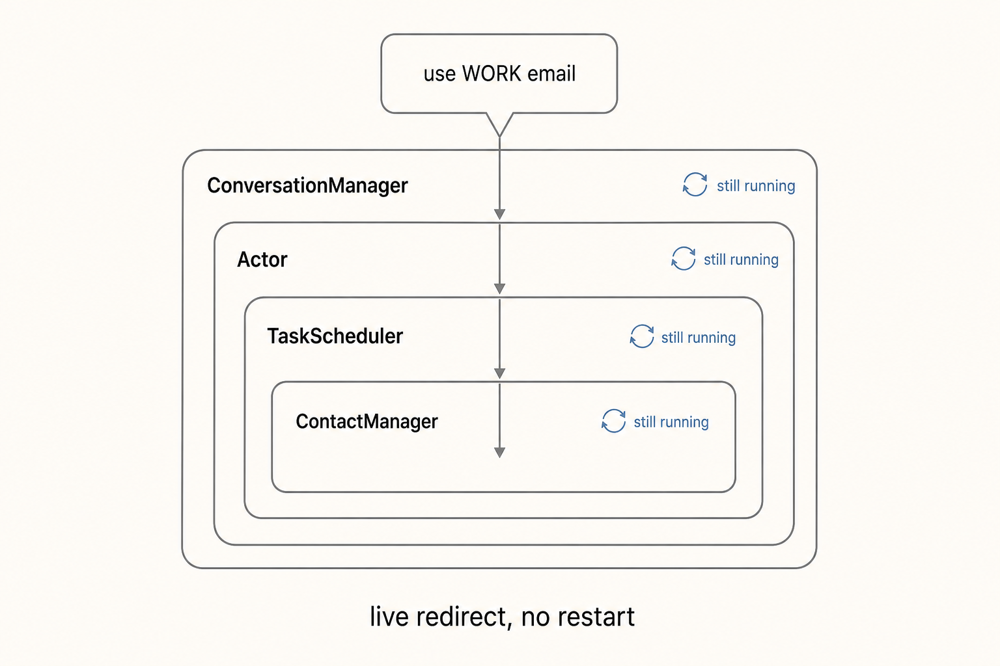
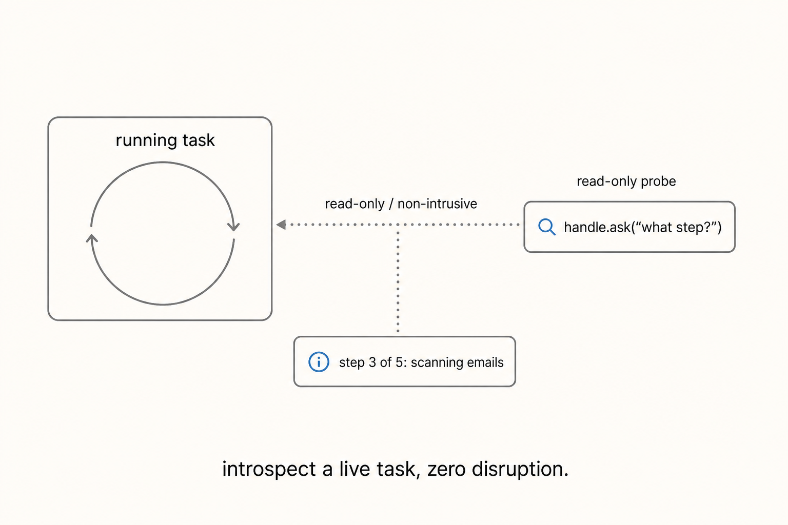
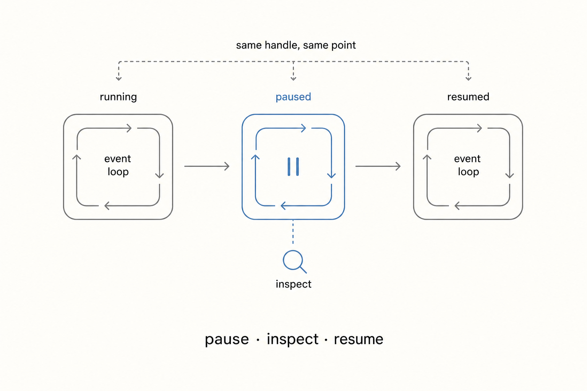
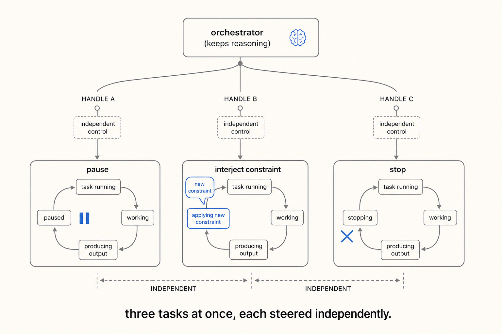
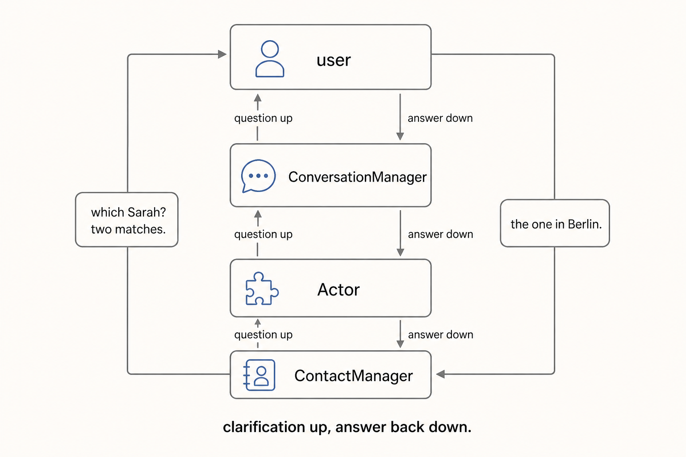
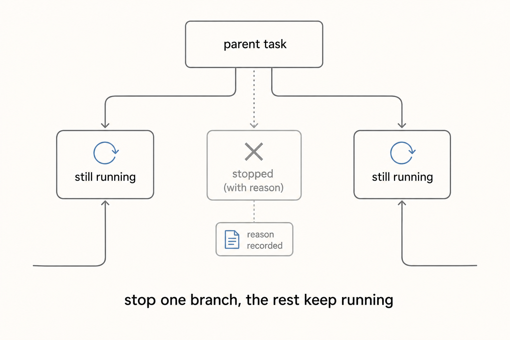

<p align="center">
  
</p>

<p align="center">
  <a href="LICENSE"></a>
  <a href="https://docs.unify.ai/basics/overview"></a>
  <a href="https://github.com/unifyai/unify/actions"></a>
  <a href="https://discord.com/invite/sXyFF8tDtm"></a>
  <a href="https://unify.ai"></a>
</p>

# Unify

**Unify is your personal AI agent that actually just talks to you. No prompting, no CLI, no configuration or setup. Just hop on a call, share your screen, share their screen, introduce yourself, explain how they can help, or just start thinking out loud. Unify will fill in the gaps 👾**

The agent runtime runs locally on your machine; persistence and your assistant live in the hosted backend at [console.unify.ai](https://console.unify.ai).

<p align="center">
  
</p>

Unify stays with you across chat, voice, phone, video, and screen-share, and stays steerable mid-task — pause it, redirect it, correct it without restarting the run. Every conversation gets distilled into **typed, queryable memory** (contacts, knowledge, tasks, files, each in its own table — not transcript soup or markdown files you maintain by hand), so Unify actually knows what your weekend rewrite is for, which libraries you care about, and the regression you asked it to watch out for last Wednesday.

After enough successful runs it **promotes what worked into a personal skill library** — executable Python *plus* the procedural how-to prose to use it — that every future session consults before reaching for raw tools. Recurring jobs and event triggers — *"every Monday at 9, digest this week's GitHub notifications"*, *"ping me whenever a CI run on `main` fails"* — are first-class **natural-language primitives**, not cron expressions or webhook YAML you hand-maintain.

**Install once, and Unify lives on your laptop, accumulating state across every session.**

**At a glance, vs the closest open-source alternatives:**

|  | Unify | OpenClaw | Hermes Agent |
|---|---|---|---|
| Persistent reasoning loop *above* the tool-caller | ✅ | — | — |
| Mid-flight steering (pause / redirect / interject) | ✅ | abort + redeliver | text injection |
| Typed memory tables (contacts, knowledge, tasks) | ✅ | markdown / JSONL | markdown + SQLite |
| Auto-grown skill library (executable code + prose) | ✅ | skills | skills |
| Schedules + triggers in plain English | ✅ | cron + webhook YAML | cron |

Full architectural comparison with diagrams is [further down](#where-unify-sits-in-the-open-source-landscape).

---

## Install

**Prerequisites:** Python 3.12+, and an LLM provider key (OpenAI, Anthropic, or DeepSeek). macOS, Linux, or WSL2. Get a Unify API key and create your assistant at [console.unify.ai](https://console.unify.ai).

```bash
curl -fsSL https://raw.githubusercontent.com/unifyai/unify/staging/scripts/install.sh | bash
```

The installer clones `unify`, syncs Python deps with `uv` (which resolves `unisdk` and `unillm`), runs a key wizard, and installs a `unify` CLI shim in `~/.local/bin/`. **Open a new terminal**, then start chatting:

```bash
unify
```

`unify` opens an interactive local chat with the full assistant runtime, talking to the hosted Orchestra backend. Run headless (ConversationManager + gateway) with `unify serve`.

```text
> What did I leave half-finished on the indexer rewrite last week?
> Watch my open PRs and ping me when one gets reviewed.
> Remind me to send Sarah the benchmark numbers on Thursday.
```

<details>
<summary>What the installer does</summary>

Clones `unify` under `~/.unity/`, runs `uv sync --all-groups`, and writes `~/.unity/unity/.env` with your `UNIFY_KEY`, `ASSISTANT_ID`, `ORCHESTRA_URL` (the hosted backend), and an LLM provider key — plus optional voice and research keys via the BYOK wizard. It installs a `unify` CLI shim in `~/.local/bin/` with a clearly-marked PATH block appended to your shell rc.

Get your `UNIFY_KEY` and `ASSISTANT_ID` from [console.unify.ai](https://console.unify.ai). If you skip a key at install time (or pipe through a non-interactive shell), add it to `~/.unity/unity/.env` and run `unify setup`.

</details>

---

## Voice — talking to your assistant in the browser

Real voice calls run the production fast-brain (interruption-handling, telephony-aware) locally with sub-second latency. Voice uses LiveKit Cloud for browser Meet, SIP calls, and Unify voice workers, so set `LIVEKIT_URL`, `LIVEKIT_API_KEY`, and `LIVEKIT_API_SECRET` alongside your speech keys. The all-repo source stack managed by `unity-deploy/selfhost` loads those LiveKit Cloud credentials from its self-host state directory.

Add a speech-to-text and a text-to-speech key (both have free tiers; pick **one** TTS provider). The install wizard prompts for these; to add them later, edit `~/.unity/unity/.env` and run `unify setup`.

| Variable | Purpose | Where to get it |
|---|---|---|
| `LIVEKIT_URL`, `LIVEKIT_API_KEY`, `LIVEKIT_API_SECRET` | Browser voice media | [cloud.livekit.io](https://cloud.livekit.io) |
| `DEEPGRAM_API_KEY` | Speech-to-text | [console.deepgram.com](https://console.deepgram.com) — free tier |
| `CARTESIA_API_KEY` *or* `ELEVEN_API_KEY` | Text-to-speech (pick one) | [play.cartesia.ai](https://play.cartesia.ai) or [elevenlabs.io](https://elevenlabs.io) — free credits |

---

## Your assistant

The local runtime drives **one hosted assistant** — the one whose `ASSISTANT_ID` you set, provisioned at [console.unify.ai](https://console.unify.ai). The multi-assistant experience (multiple named teammates, organisations, real telephony, inbound channel integrations, third-party app integrations, screen-share, billing, and the onboarding flow) is part of the hosted product.

---

## What works locally

Everything below runs on your machine after install, against the hosted backend:

- **Chat** with your assistant — an LLM key (OpenAI, Anthropic, or DeepSeek) is what lets it think and reply.
- **Browser voice calls** — a Deepgram (speech-to-text) key lets it hear you, and a Cartesia or ElevenLabs (text-to-speech) key lets it speak back.
- **Web search** — a free [Tavily](https://tavily.com) key lets it look things up on the web while researching.
- **Computer use** — it drives a real browser and desktop; an optional [AntiCaptcha](https://anti-captcha.com) key lets it get past CAPTCHAs instead of stalling.

The onboarding flow, inbound messaging channels (SMS / WhatsApp / phone, Slack, Gmail, Outlook, Teams, Discord), Google / Microsoft workspace connect, third-party app integrations, and screen-share are part of the hosted product at [console.unify.ai](https://console.unify.ai).

---

## Day-to-day commands

```text
unify                    Interactive local chat (alias: unify chat)
unify serve              Run headless: ConversationManager + gateway
unify stop               Stop the local runtime
unify status             Show runtime status
unify logs               Follow the runtime log
unify doctor             Gateway/config checks
unify setup              Re-run the key/credential wizard
unify update             Update the checkout and re-sync deps
```

Bring-your-own-keys (LLM, voice, research) live in `~/.unity/unity/.env` — edit them and run `unify setup`.

---

## Steering while work is in-flight

When Unify is mid-task in the local chat REPL, steer it the same way you would in the hosted Console: **send another message**. There are no special slash commands (`/ask`, `/i`, `/stop`) in `unify` — those were an old sandbox experiment and are not wired to the runtime.

**Text:** use `msg` at the `>` prompt:

```text
> msg Actually, narrow it to ones with Rust bindings.
> msg What step are you on?
```

Each `msg` publishes a normal inbound Unify chat message. The ConversationManager wakes the slow brain, which can answer you or redirect in-flight Actor work through its usual action-steering tools (`interject_*`, `ask_*`, `stop_*`, etc.).

**Voice:** type `meet` to open a LiveKit browser session, then speak through your mic. Utterances follow the same Unify Meet path as production voice — no separate steering syntax.

Use `trace`, `tree`, or `show_logs` for debugging while work is in-flight, or send another `msg` when you want to steer.

---

## What this feels like

```text
You          ▸  "Find me high-throughput vector DBs under Apache 2."
Unify        ▸  (starts searching)
You          ▸  "Actually, narrow it to ones with Rust bindings."
Unify        ▸  (adjusts the in-flight search — doesn't restart)
You          ▸  "Pause that, something urgent."
Unify        ▸  (freezes exactly where it is)
... five minutes later ...
You          ▸  "OK, resume. How's it going?"
Unify        ▸  (picks up where it left off, gives you a status update)
```

```text
Unify        ▸  (on a live call with your ISP about a renewal)
You          ▸  (in a side chat) "Don't agree to anything over $100/mo."
Unify        ▸  (the constraint reaches the call mid-conversation)
```

```text
Unify        ▸  Three tasks running at once.
                  [0] watch_pr_reviews    ██████████░░░  in progress
                  [1] digest_releases     ████████████░  in progress
                  [2] retry_failed_build  ██░░░░░░░░░░  starting
                Each one independently inspectable, steerable, and pausable.
```

---

## Highlights

<table>
<tr><td><b>🎙️ Takes calls like a person</b></td><td>Voice, phone, and video calls with screen-share and webcam streamed in real time — a participant in the conversation, not a tool that initiates one.</td></tr>
<tr><td><b>✋ Interruptible mid-task</b></td><td>Every operation can be paused, resumed, redirected, or queried while it's running — including operations <i>nested inside other operations</i>, all the way down.</td></tr>
<tr><td><b>🧠 Plans in code, not tool-by-tool</b></td><td>Multi-step work is one sandboxed Python program with real variables, loops, and control flow — not a chain of one-tool-at-a-time JSON decisions.</td></tr>
<tr><td><b>📞 One identity across every channel</b></td><td>Chat, SMS, email, phone, voice, video — all feed the same memory. Sarah is the same Sarah whether she texted, called, or mailed.</td></tr>
<tr><td><b>📚 Structured memory, not transcript soup</b></td><td>Contacts, knowledge, tasks, and files live in typed, queryable tables — distilled from conversations every fifty messages, not piled into markdown.</td></tr>
<tr><td><b>⚙️ Learns reusable skills</b></td><td>After a successful trajectory, the assistant saves both the underlying Python (with metadata + venv) and the procedural prose for using it — the next session composes them into a plan instead of re-deriving.</td></tr>
<tr><td><b>🔀 Concurrent work, independently steerable</b></td><td>Multiple actions run at once — pause one, redirect another, ask a third for status, without affecting the rest.</td></tr>
<tr><td><b>⏰ Schedules and triggers in plain English</b></td><td><i>"Every Monday at 9, digest this week's GitHub notifications"</i>, <i>"ping me whenever a CI run on `main` fails"</i> — natural-language <code>Task</code> rows that can graduate into stored functions.</td></tr>
<tr><td><b>🔌 Local-first, fully open</b></td><td>Runtime, persistence backend, LLM client, and Python SDK are all MIT-licensed and run locally with one Docker command. Hosted backend optional.</td></tr>
</table>

---

## How it works

A persistent **interaction loop** (`ConversationManager`) stays present across every medium and keeps thinking while work is in flight. When something needs deeper reasoning, it dispatches a **background reasoner** (`Actor`) that writes Python plans over a back office of typed state managers. Every operation returns a live, steerable handle, and those handles nest — a correction the user makes in chat propagates *down* through the dispatched action into whatever manager call is currently running.

This is the same **interaction loop / background reasoner** split [recently articulated by Thinking Machines](https://thinkingmachines.ai/blog/interaction-models/) — they put it *inside the model* (one model trained to interact natively); Unify arrives at the same shape at the harness level. When interaction-native models ship publicly, they would replace Unify's fast/slow-brain split end-to-end.

<p align="center">
  
</p>

**Solid arrows** are dispatch. **Dotted arrows** are the *steering bus* — every level returns the same `SteerableToolHandle`, so a mid-flight redirect doesn't abort the run, doesn't append a second prompt, and doesn't wait for the next tool boundary. It propagates through the live nested call stack as a typed signal any inner manager loop can act on.

<p align="center">
  
</p>

---

## Under the hood

### Steerable handles — the universal protocol

Every public manager method returns one — same `ask`, `interject`, `pause`, `resume`, `stop` surface at every level of the call stack.

```python
handle = await actor.act("Survey high-throughput vector DBs and draft a comparison")
await handle.interject("Only ones with Rust bindings")   # mid-flight redirect
await handle.pause(); ...; await handle.resume()         # freeze and resume
```

When the Actor calls `primitives.contacts.ask(...)`, the `ContactManager` returns its own handle — nested inside the Actor's, which is nested inside the `ConversationManager`'s. Steering at any level propagates down through the live call stack as a typed signal any inner loop can act on, not as an abort or a queued-prompt.

### CodeAct — the Actor writes Python programs

Most agents emit one JSON tool call at a time and let the LLM stitch results across turns. Unify's Actor writes a single sandboxed Python program per turn over typed `primitives.*`:

```python
deps = await primitives.knowledge.ask(
    "Which Python deps am I tracking for security updates?"
)
for dep in deps:
    latest = await primitives.web.ask(
        f"What's the latest released version of {dep}?"
    )
    await primitives.knowledge.update(
        f"Record that {dep}'s latest known release is {latest}."
    )
```

A memory lookup → external check → memory write becomes one coherent plan with real variables, loops, and control flow — rather than three separate tool-selection turns round-tripping through tool messages.

### Dual-brain voice and video

Live calls run two coordinated brains:

- **Slow brain** (`ConversationManager`) — sees everything, decides deliberately, runs in the main process.
- **Fast brain** — a real-time LiveKit voice agent in a subprocess, sub-second latency, handles turn-taking autonomously.

They communicate over IPC. The slow brain steers the fast brain with **SPEAK** (say exactly this), **NOTIFY** (here's context, decide what to do), or **BLOCK** (do nothing; carry on). Screen-share and webcam frames stream to both, so the fast brain answers *"can you see my screen?"* without round-tripping while the slow brain folds visual context into longer plans.

### Functions and Guidance — a dual library

Two persistent libraries the Actor consults before reaching for raw tools:

- **`FunctionManager`** — executable Python (with metadata and a venv) the Actor composes into plans.
- **`GuidanceManager`** — procedural how-to prose: SOPs, software walkthroughs, multi-step strategies.

After a successful trajectory, a reviewer loop (`store_skills`) can extract *both* — code worth keeping plus the narrative for using it.

### Schedules and triggers — stored as `Task` rows

Recurring/triggered work is stored as a `Task` with `schedule` + `repeat` (cadences) or `trigger` (event matches). When the time arrives or the trigger fires, a contained `Actor` run wakes up, reads the description, and figures out how to do it. After enough successful runs the storage-review loop can persist the trajectory as a stored function — at which point the task runs against that function rather than re-planning each time.

### Memory consolidation — every fifty messages

`MemoryManager` runs a background extraction pass over each new transcript window, distilling **contact profiles**, **per-contact summaries**, **response policies**, **domain knowledge**, and **task commitments** into the typed manager tables.

### Concurrent steerable actions

```text
┌─ In-Flight Actions ────────────────────────────────┐
│                                                     │
│  [0] watch_pr_reviews    ██████████░░░  In progress │
│      → ask, interject, stop, pause                  │
│                                                     │
│  [1] digest_releases     ████████████░  In progress │
│      → ask, interject, stop, pause                  │
│                                                     │
│  [2] retry_failed_build  ██░░░░░░░░░░  Starting     │
│      → ask, interject, stop, pause                  │
│                                                     │
└─────────────────────────────────────────────────────┘
```

Each action gets its own dynamically-generated steering tools on the slow brain's tool surface — inspect, interject, pause, resume, or stop any one without touching the rest.

### Putting it together

For the full breakdown — async tool loop internals, event bus, primitive registry, hosted deployment SPI — see [`ARCHITECTURE.md`](ARCHITECTURE.md). The manager map at a glance:

```text
ConversationManager (interaction loop, event-driven scheduling)
    │
    │   Slow Brain ◄── IPC ──► Fast Brain (real-time voice + video, LiveKit)
    │
    ▼
CodeActActor (generates Python plans, calls primitives.* APIs)
    │
    ▼
State Managers (each runs its own async LLM tool loop)
    │
    ├── ContactManager        — people and relationships
    ├── KnowledgeManager      — domain facts, structured knowledge
    ├── TaskScheduler         — durable tasks, schedules, triggers, execution with live handles
    ├── TranscriptManager     — conversation history and search
    ├── GuidanceManager       — procedures, SOPs, how-to knowledge
    ├── FileManager           — file parsing and registry
    ├── ImageManager          — image storage, vision queries
    ├── FunctionManager       — user-defined functions, primitives registry
    ├── WebSearcher           — web research orchestration
    ├── SecretManager         — encrypted secret storage
    ├── BlacklistManager      — blocked contact details
    └── DataManager           — low-level data operations
    │
    ├── EventBus              — typed pub/sub backbone (Pydantic events)
    └── MemoryManager         — offline consolidation every 50 messages
```

---

## Where Unify sits in the open-source landscape

OpenClaw and Hermes Agent are excellent — both are mature personal assistants with wide messaging surfaces, large contributor communities, and well-trodden install paths. Unify is making a different architectural bet, and the easiest way to see it is to draw all three using the same visual language: identical panel, identical box and arrow grammar, identical colour semantics. Every visual difference between the three diagrams below maps to a real architectural difference; nothing is stylistic.

The colour palette is locked across all three diagrams and means exactly one thing each:

- **Green** — the agent's tool-calling loop (the loop that actually calls tools to do work). Every assistant has one; every diagram has exactly one green box.
- **Peach** — an autonomous wake source: a non-user input that can cause the agent to think without a fresh user message. Every assistant has one; the *label* encodes the mechanism (cron + webhooks vs. natural-language scheduled Tasks vs. ...), but the *colour* is universal.
- **Pink** — a *persistent reasoning loop* above the agent: a layer that keeps reasoning while a dispatched action is in flight, distinct from a persistent process or daemon. This is the only colour whose presence varies across the family — and that's the headline architectural distinction the comparison exists to surface.
- **White** — passive structural tiers (channels / surfaces / mediums, tools, state, dispatcher daemon).

<details open>
<summary><b>Unify</b> — persistent reasoning loop above a supervised Actor, with a dual-brain conversation tier</summary>

<p align="center">
  
</p>

Unify puts a persistent reasoning loop (`ConversationManager`, pink) *above* the tool-caller rather than beside it — the slow brain stays present and keeps reasoning while a dispatched action runs. Real-time voice and video sit on a separate fast brain coordinated over IPC, so the slow brain deliberates without blocking sub-second turn-taking. Below it, a supervised `CodeActActor` writes one Python program per turn over typed `primitives.*`. Long-lived state is a back office of typed managers, not opaque session files. Schedules and triggers are natural-language `Task` rows fired in-process by an asyncio timer wheel (no Cloud Tasks, no K8s) — and inbound-event triggers like *"whenever a CI run on `main` fails"* remain Unify-unique among the three.

</details>

<details>
<summary><b>OpenClaw</b> — channel-first dispatcher + single Pi agent loop</summary>

<p align="center">
  
</p>

OpenClaw is a local-first control plane with a wide channel matrix and a plugin marketplace. The Gateway *dispatches* runs onto a single Pi agent loop but doesn't supervise them; voice is a plugin tool the agent invokes through discrete actions. Cron, HTTP webhook ingress, and Gmail Pub/Sub run as an in-process timer + HTTP server inside the Gateway. Mid-flight steering doesn't exist — new messages are handled at turn boundaries (`interrupt` aborts, `steer`/`followup` enqueues). `VISION.md` explicitly takes "no agent-hierarchy frameworks (manager-of-managers)" as a non-goal — a principled bet opposite to Unify's. Excellent if you want broad channel coverage and a plugin ecosystem; Unify is shaped for the orthogonal brief.

</details>

<details>
<summary><b>Hermes Agent</b> — many surfaces, one monolithic loop</summary>

<p align="center">
  
</p>

Hermes pairs a single ~12k-LOC sync agent-loop with four surfaces (CLI, TUI, gateway, ACP), a deep markdown skills library, SQLite+FTS5 transcripts, and a mature cron + webhook automation subsystem (background thread + aiohttp server inside the gateway). Steering is text injection into the next tool result; interrupt is a thread-scoped flag. Live telephony isn't in the repo — SMS is, voice is local-only. Excellent if you want a polished personal-agent product with a wide messaging surface; Unify is making a different bet on the orchestration layer — a permanent reasoning loop above the tool-caller, and steering as a first-class signal that nests through every manager call.

</details>

### Bring their skills with you — importing into the GuidanceManager

OpenClaw and Hermes Agent both represent skills as `SKILL.md` files (the [agentskills.io](https://agentskills.io) standard: YAML frontmatter + a markdown body, with optional bundled `scripts/`). That maps almost one-to-one onto a `GuidanceManager` entry, so either skill library can be imported off-the-shelf as guidance:

```bash
# Dry run (the default): print what would be imported, write nothing
.venv/bin/python -m scripts.skill_migration.openclaw_to_guidance
.venv/bin/python -m scripts.skill_migration.hermes_to_guidance

# Import for real (titles are namespaced "[openclaw] …" / "[hermes] …")
.venv/bin/python -m scripts.skill_migration.openclaw_to_guidance --execute
.venv/bin/python -m scripts.skill_migration.hermes_to_guidance  --execute
```

Each script looks for a sibling checkout (`../openclaw`, `../hermes-agent`) by default; pass `--repo-root` to point elsewhere. A skill's `description` and markdown body become the guidance `content`, and any bundled `scripts/` are inlined verbatim as a textual reference — a deliberately faithful, no-magic transfer. Promoting that inlined code into a runnable `FunctionManager` function (and linking it back via `function_ids`) is a separate, deliberate step. Re-runs skip titles that already exist; pass `--conflict overwrite` to update them in place instead.

---

## Steering in practice — six things a single agent loop can't do

The architectural bet above isn't abstract. Because *every* operation — at every level of the call stack — returns the same live `SteerableToolHandle`, a handful of interactions become natural that a single blocking agent loop (which can ultimately only *abort* or *wait*) can't express. Each is folded away below; expand any that interests you.

<details>
<summary><b>1. Course-correct a task that's running three loops deep — live</b></summary>

<p align="center">
  
</p>

Kick off work that nests `ConversationManager → Actor → TaskScheduler → ContactManager`. Halfway through, say *"use their work email, not personal."* The correction travels **down the live call stack** into the innermost loop and changes its behaviour — no restart, no second prompt appended, no waiting for the next tool boundary. A monolithic loop can only hard-interrupt the child and start it over from scratch.

</details>

<details>
<summary><b>2. Ask a busy task what it's doing — without disturbing it</b></summary>

<p align="center">
  
</p>

`handle.ask("what step are you on and why?")` spins up a **read-only inspection loop** over the task's in-flight transcript and returns an answer while the task keeps running — recursing into deeper nested handles if you want detail. You're interrogating live reasoning mid-flight, not polling a status string the agent remembered to update.

</details>

<details>
<summary><b>3. Freeze a nested operation, look inside, resume exactly where it left off</b></summary>

<p align="center">
  
</p>

`pause()` halts new reasoning at the current point — propagating across the whole nested stack — while you inspect intermediate state or interject a constraint. `resume()` picks up from exactly where it stopped. An interrupt-only model can *stop*, but it can't freeze-and-continue.

</details>

<details>
<summary><b>4. Run three tasks at once and steer each one differently</b></summary>

<p align="center">
  
</p>

Hold a live handle to each of several concurrent actions. **Pause** one, **interject** a new constraint into another, **stop** a third — all while the orchestrator keeps reasoning and the rest run untouched. Each gets its own dynamically-generated steering tools on the orchestrator's surface. Delegation that blocks the parent until a child returns offers no per-task live control.

</details>

<details>
<summary><b>5. Surface a clarification from the innermost loop — and route the answer back down</b></summary>

<p align="center">
  
</p>

When an inner manager hits genuine ambiguity, its clarification **bubbles up through every intervening layer** to you; your answer flows back **down** to the loop that asked, and the original deep operation completes — without unwinding the stack. A single-level clarification primitive can't surface a question from three orchestration layers down.

</details>

<details>
<summary><b>6. Stop one branch of a fan-out without touching its siblings</b></summary>

<p align="center">
  
</p>

`stop()` a single nested branch — with a reason that's recorded as a synthetic tool call in the transcript — while its sibling branches carry on. A thread-scoped abort flag is all-or-nothing across a subtree; here the cut is surgical.

</details>

---

## The runtime stack

Unify is one of three MIT-licensed repos that make up the open agent runtime. They talk to the hosted Orchestra backend; you can also use any of them independently.

| Repo | Role |
|------|------|
| **unify** (this) | Agent runtime — managers, tool loops, CodeAct, voice, orchestration |
| **[unify](https://github.com/unifyai/unify)** | Python SDK — how Unify talks to Orchestra |
| **[unillm](https://github.com/unifyai/unillm)** | LLM access layer — OpenAI, Anthropic, or any compatible endpoint |
| **orchestra** | Persistence backend — FastAPI + Postgres + pgvector; hosted at [console.unify.ai](https://console.unify.ai) |

---

## Running the tests

Tests exercise the real system (steerable handles, CodeAct, manager composition, nested tool loops) against simulated backends with cached LLM responses:

```bash
uv sync --all-groups
source .venv/bin/activate

tests/parallel_run.sh tests/                    # everything
tests/parallel_run.sh tests/actor/              # one module
tests/parallel_run.sh tests/contact_manager/    # another
```

See [tests/README.md](tests/README.md) for the full philosophy — responses are cached, not mocked. Delete the cache and you're re-evaluating against live models.

---

## Where to start reading

| File | What's there |
|------|-------------|
| `unify/common/async_tool_loop.py` | `SteerableToolHandle` — the protocol everything returns |
| `unify/common/_async_tool/loop.py` | The async tool loop engine — nesting, steering, context propagation |
| `unify/actor/code_act_actor.py` | CodeAct — plan generation, sandbox, primitives |
| `unify/conversation_manager/conversation_manager.py` | Dual-brain orchestration, debouncing, in-flight actions |
| `unify/conversation_manager/domains/brain_action_tools.py` | How the brain starts, steers, and tracks concurrent work |
| `unify/conversation_manager/domains/call_manager.py` | LiveKit subprocess + voice/video event wiring |
| `unify/function_manager/primitives/registry.py` | How primitives are assembled into the typed API surface |
| `unify/events/event_bus.py` | Typed event backbone |
| `unify/memory_manager/memory_manager.py` | Offline consolidation pipeline |

---

## Project structure

```text
unify/
├── unify/             # Main package — actor, conversation_manager, common, and one folder per state manager (see manager map above)
├── sandboxes/         # Dev / eval playgrounds, one per manager; backs the `unify` CLI
├── tests/             # Pytest suite (cached LLM responses)
├── agent-service/     # Node.js desktop / browser automation
└── deploy/            # Dockerfile, Cloud Build, virtual desktop
```

---

## License

MIT — see [LICENSE](LICENSE).

Built by the team at [Unify](https://unify.ai).
