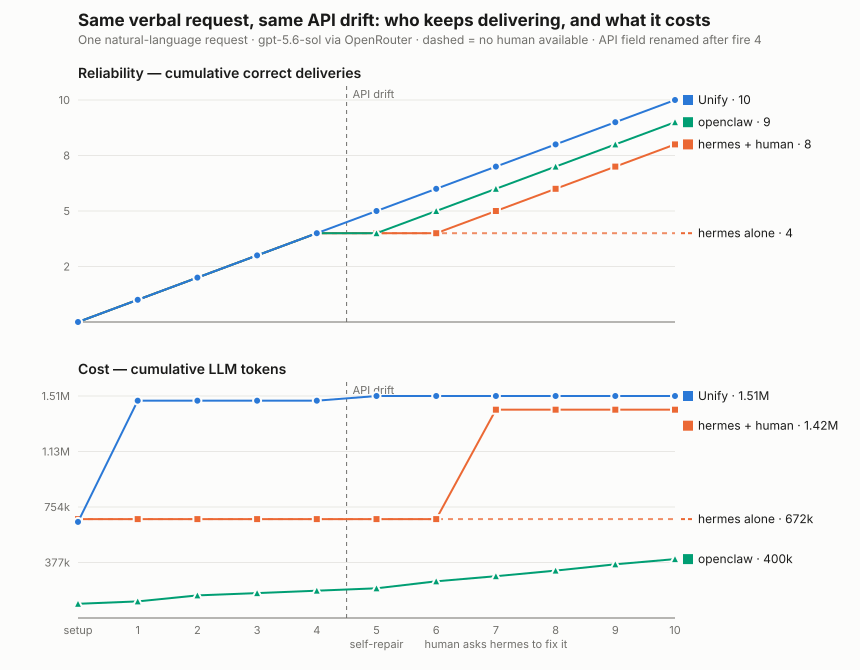

# Drift recovery

**Question:** after both systems converge a verbally-specified recurring
workflow to their zero-LLM steady state, the external API drifts — one field
rename, the smallest realistic schema change. What happens to **cost** and
**reliability**?

**The architectural asymmetry under test.** Unify's steady state executes a
stored `FunctionManager` entrypoint with a bounded repair loop wired in
(`entrypoint_repair_attempts=1`): on failure, an LLM sees the exception plus
the function source, rewrites the function in place (persisted with
`overwrite=True`), and the same run retries — self-healing, paid only when
something actually breaks. hermes-agent's steady state (`no_agent` cron +
standalone script, as its agent converged to in experiment 1) has **no model
in the loop at all**: nothing observes the failure, so the automation stays
broken until a human notices and asks the agent to fix it. This experiment
prices both sides of that asymmetry with real inference.

## Workflow

"Process new orders hourly" — chosen to be fire-timing-independent (no
wall-clock coupling to tempt schedule hacks): the sink is the cursor
(`GET /batches/last`), each run fetches orders after the cursor, computes a
batch summary, and POSTs it. The fixture (`fixture.py`) releases
`ORDERS_PER_FIRE` new seeded orders before every fire, so every fire has
real, deterministic work, and ground truth per seq-range is exact. The
identical utterance both arms receive is `UTTERANCE_TEMPLATE` in
`protocol.py`.

## Protocol

- 10 fires. After fire 4, `/orders` renames `unit_price_cents` →
  `unit_price_minor` (values identical; the POSTed batch contract never
  changes).
- Unify arm: no human intervention, ever. Whatever the repair loop does is
  the result.
- hermes arm: after 2 consecutive failed fires, the harness plays the
  realistic operator move — one natural-language "it's been failing, please
  investigate and fix it" chat message — measured like any other phase.
  Missed ranges are recoverable via the cursor, so a successful fix also
  catches up; per-fire correctness still records the outage.
- Scoring per fire: exactly one batch delivered, exactly-correct totals,
  correctly chained to the previous batch. Metering as in experiment 1
  (chained unillm ledger for unify; recording proxy for hermes; same pinned
  model `openai/gpt-5.6-sol@openrouter`).

## Outputs

`results/<run-id>-{unify,hermes}/` with `results.json`, per-phase tables,
raw ledgers, and `summary.md`. `plot.py` renders the digest graph
(`drift_recovery.svg`): cumulative correct deliveries (reliability) and
cumulative LLM tokens (cost) per fire, drift marked — one line keeps
climbing with a single cost blip; the other flatlines until a human pays
for a full agent session.

```bash
bash benchmarks/drift_recovery/run_unify.sh
bash benchmarks/drift_recovery/run_hermes.sh
.venv/bin/python -m benchmarks.drift_recovery.plot
```

## Measured results (2026-07-31, gpt-5.6-sol@openrouter)



| arm | correct fires | total tokens | recovery |
|---|---|---|---|
| **unify (current: `5fb19164d` + probe `54987ca06`)** | **10/10** | 1.51M | **in-run self-repair at fire 5** — the repair probed the live API, fixed the function in place (3 calls, $0.18, 82s), delivered the same fire; fires 6–10 back to 0 tokens |
| hermes + human | 8/10 | 1.42M | operator noticed 2 failures and asked hermes to fix itself (739k-token session) |
| hermes alone | 4/10 → flat forever | 0.67M | none possible: `no_agent` script has no model in the loop |
| unify (fixed, pre-probe) | 6/10 | 1.74M | autonomous but blind: 4 fire-by-fire repair attempts — see `2026-07-31T11-54-41Z-unify/NOTE.md` |
| unify (pre-fix baseline) | 4/10 | 2.89M | none — see `2026-07-31T11-08-13Z-unify/NOTE.md`; defects fixed in `5fb19164d` |

The benchmark's first unify run failed outright and yielded five production
fixes (repair-prompt contract framing, `overwrite` swallowed from the
`add_functions` schema, unresolvable entrypoint attaches, description-
anchored no-op completions, and a read-only diagnostic probe so repair
observes the environment instead of guessing). The current result is the
designed curve: reliability never dips through the schema change, drift
costs one $0.18 blip, and no human is ever involved — while hermes's
recovery needs an operator, and without one it stays broken forever.
