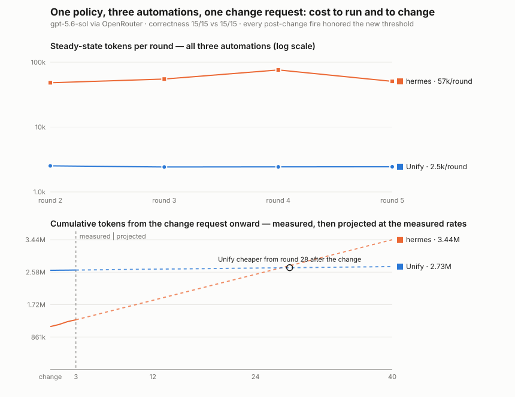

# Policy propagation

**Question:** three recurring automations share one business policy, stated
verbatim in each of the three verbal requests that created them. One verbal
policy-update message later — what does the change cost, and does every
automation actually behave per the new policy afterwards?

## Task family

One seeded inquiry stream, three automations with separate sinks/cursors:
hourly **triage** (category + priority per policy), daily **digest**
(urgent counts by category), weekly **audit** (urgent totals/fraction).
The escalation policy: urgent when a charge/billing amount ≥ $500 is
involved, or the customer is blocked from working. The change: threshold
drops to $250. Golden labels are mechanical (amounts and blocked-phrasing
are generator-controlled) and validated to 100% agreement with the
benchmark model at both thresholds across repeated samples; every
post-change scoring window contains at least one item whose priority flips.

## Measured results (2026-07-31, gpt-5.6-sol@openrouter)



| | Unify (factored guidance) | hermes | openclaw |
|---|---|---|---|
| correctness (15 fires, both epochs) | **15/15** | **15/15** | 10/15 fully exact (14/15 met the delivery contract) |
| change propagated to all three automations | yes — guidance canon + 3 linked functions | yes (3 prompt edits) | yes (3 cron payloads rewritten) |
| change-application cost | 1.02M tokens / $2.72 | 1.14M tokens | **142k tokens** |
| steady state, whole family per round | **~2.2k tokens** | ~57k tokens | ~80k tokens |
| payback of the change-cost gap | cheaper than hermes from the change itself | — | change wins outright; steady state repays unify's gap in ~11 rounds |

The openclaw arm (2026-07-31, added later the same day) splits the axes:
its change session is ~7× cheaper than either other arm (its cron store is
small and legible to its own agent, which rewrote all three payloads in
one 54s turn), but it is the only arm that dropped exactness — none of
the misses are propagation failures; they are per-fire judgment variance
in the triage automation plus one bootstrap contract miss, detailed in
the run's NOTE.md — and its steady state is the most expensive of the
three.

Correctness tied at 15/15; unify wins both cost axes. The storage reviews
factored the policy into **one guidance entry** ("Customer inquiry triage
and escalation policy") linked via `function_ids` to all three functions —
reviews 2 and 3 linked into the first review's entry instead of
duplicating it — and the change session used those links as its impact
set, updating the canon and every linked function and verifying no stale
threshold remained.

This shape did not emerge on the first attempt. The pre-factoring baseline
(`2026-07-31T18-14-10Z-unify/NOTE.md`) embedded the policy in each
function (change: 2.63M tokens / $10.13, ~2.3× *more* than hermes) —
the storage prompts framed guidance solely as compositional recipes.
Unify commit `9f54cf012` made shared rules a first-class guidance concern
(fully general wording: durable rules/policies get one canonical linked
entry; updates treat `function_ids` as the authoritative impact set),
validated first on a one-automation slice (`slice_check.py`), then
confirmed here. Storage-time reviews cost ~230k tokens more each (the
search-and-link work); the change dropped 1.6M — net positive after one
change, and every future change of the same rule is cheap.

## Notes

- The calibration round (earlier result directories, kept with NOTE.md)
  had two ambiguous golden templates; both arms produced byte-identical
  score dents on them — the systems agreed with each other and disagreed
  with the labels, which is direct evidence the harness treats both arms
  equally. The fixture was recalibrated before the definitive runs.
- Running the unify arm surfaced two staging-infrastructure fixes along
  the way: internal-domain accounts are now exempt from the trial
  anti-abuse gates (orchestra `40d69258`), and the shared tenant's credit
  balance was topped up via the existing `create_recharge` admin promo.

```bash
bash benchmarks/policy_propagation/run_unify.sh
PP_PORT=8133 PP_PROXY_PORT=8134 bash benchmarks/policy_propagation/run_hermes.sh
.venv/bin/python -m benchmarks.policy_propagation.plot
```
