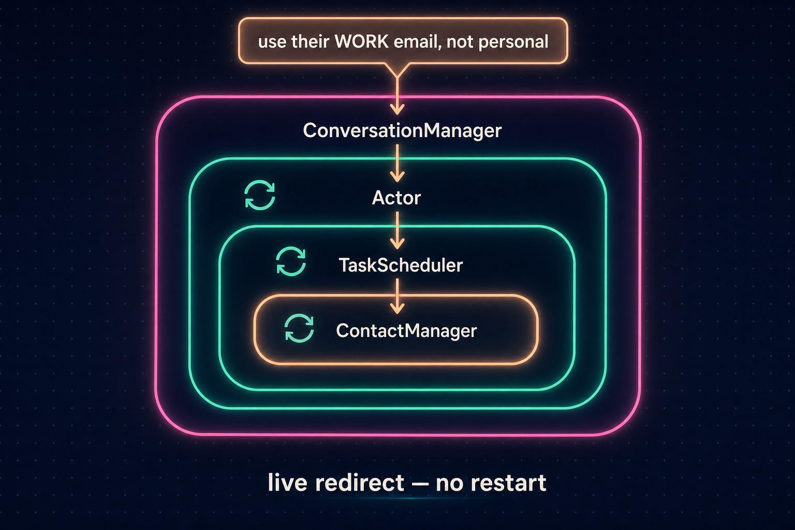
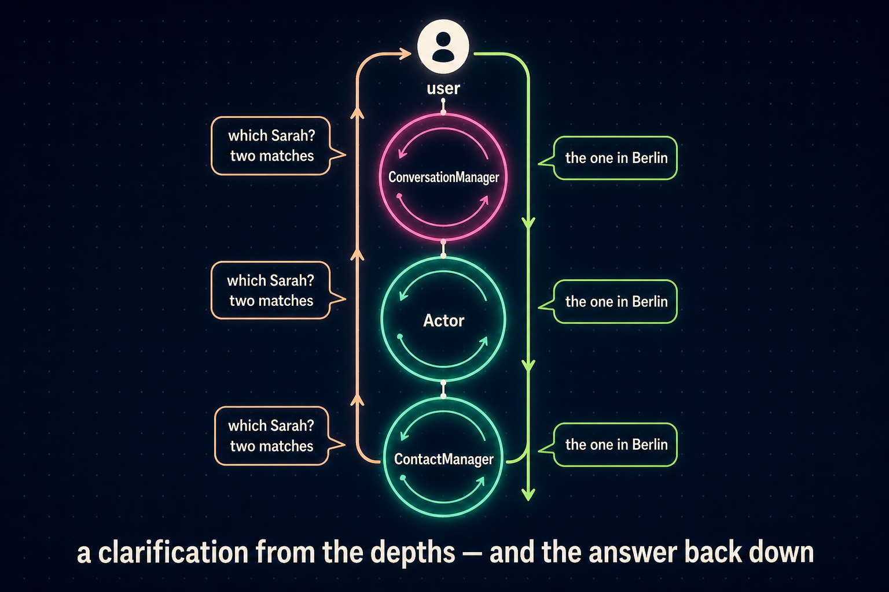

# Agents that pick up where they left off

Most agent frameworks give you one of two ways to work.

The first is fire-and-forget. You hand the agent a task, it runs, and it comes back with a result or an error. If you want a follow-up — "great, now do the same for the March data" — you start a new task from scratch. The new run has none of the old one's context. The credentials it discovered are gone, and so is everything it learned about the API it spent ten minutes figuring out. It re-derives all of that, slowly, or it gets it subtly wrong.

The second is chat. You keep full shared context, but you're supervising every step. The agent can't go away and work for twenty minutes while you do something else.

Neither is how you'd work with a colleague. You hand them a chunk of work and they go do it. You can tap them on the shoulder mid-task, and they can come back to you with a question. And when they hand you the result, the conversation isn't over — "actually, can you also…" lands in the same shared context, not a blank slate.

We built Unify's runtime around that third model. The inner agent loop itself is table stakes now. The plumbing between the outer conversation and the inner working loops is not, and that's where we spent our time. Three channels run between them.

## The shape

The outer loop is the [`ConversationManager`](https://github.com/unifyai/unify/blob/main/unify/conversation_manager/conversation_manager.py): the thing you actually talk to, whether over chat or on a live call. It doesn't do the work itself. When work needs doing, it calls `act(query, persist=...)`, which spawns a [`CodeActActor`](https://github.com/unifyai/unify/blob/main/unify/actor/code_act_actor.py) with its own LLM transcript and its own Python sandbox.

<p align="center">
  <picture>
    <source media="(prefers-color-scheme: dark)" srcset="https://raw.githubusercontent.com/unifyai/.github/main/public_images/architecture-flow-dark.png">
    
  </picture>
</p>

Every running action is tracked in `in_flight_actions`. The ConversationManager's own tool list is then regenerated dynamically, with per-action steering tools for each one:

- `interject_<name>__<id>` — push a correction or follow-up into the running task
- `ask_<name>__<id>` — inspect what the task is doing without disturbing it
- `pause_<name>__<id>` / `resume_<name>__<id>` — suspend and continue
- `stop_<name>__<id>` — cancel
- `answer_clarification_<name>__<id>__<call>` — appears only while the task is blocked on a question

So when you message the assistant mid-task, the model deciding what to do with your message literally has a tool named after the running task sitting in front of it. Routing your correction into the right piece of in-flight work is an ordinary tool call, not a special case.

## Persistent sessions: finishing isn't ending

The simplest channel to state is `persist=True`: completing the work doesn't end the session.

A normal (`persist=False`) action returns its result and is gone. The handle moves to `completed_actions`, where all you can still do is ask questions about what happened. A persistent action finishes a piece of work, surfaces its response upward, and then blocks, waiting:

```python
# unify/common/_async_tool/loop.py — end of a turn, persist mode
if persist:
    await _outer._notification_q.put(
        {"type": "response", "content": _response_to_surface},
    )
    logger.info("Persist mode: waiting for next interjection...")
    ...
    # Block until an interjection arrives or cancellation is requested
    ...
    continue  # Back to top of loop to process the interjection

return final_content  # persist=False: DONE
```

The ConversationManager sees the response, marks the action `awaiting_input`, and keeps it in `in_flight_actions`. The task is done but the session is alive. The full inner transcript is still in memory, and so is the Python sandbox with whatever state the work built up.

There's deliberately no separate "resume session" API. Continuation is just another interjection. When you say "now do March", the outer model calls `interject_<name>__<id>` and the same loop wakes up, with the new instruction appended to the transcript it already has. From the inner model's point of view, a follow-up is indistinguishable from a mid-task correction. That's the right semantics, because that's what it is.

This sounds like a small difference from "start a new task with a summary of the old one". It isn't. Summaries lose the things you didn't know would matter. A live session keeps state that never made it into text — an authenticated client object sitting in a sandbox variable, say. The monthly-report follow-up that would have been a cold start becomes one line into a warm context.

The cost is that keeping sessions alive is a real decision. Our system prompt pushes the outer model to default to `persist=True` whenever a follow-up is plausible, and to close sessions explicitly with `stop_*` instead of letting `persist=False` silently throw away context we turn out to need.

## Talking down: interjection

Interjections are how corrections get in. When the outer loop calls `handle.interject(message)`, the message lands on the inner loop's queue and is appended to its transcript as a user message. Not a system message, not a synthetic tool result. The inner model sees it the way it sees any instruction, tagged so it knows it arrived mid-task.

It's also immediate. The inner loop runs with `interrupt_llm_with_interjections` enabled, so it races the in-flight LLM generation against the interjection queue. If your correction arrives while the model is mid-generation, the generation is cancelled and restarted with your message included. You're not waiting for the current step to finish before "no, wrong account" takes effect.

<p align="center">
  
</p>

## Talking up: clarification

The inner loop gets the mirror-image channel. An actor started with clarification enabled has `request_clarification(question)` in its tool surface. Calling it blocks that exact call site. The question travels up through the handle's clarification queue, the ConversationManager wakes and relays it to the user, and an `answer_clarification_*` tool appears for the pending question. When the answer comes back, it's routed down the same queues and the blocked call returns with the answer as its value.

So "which of these two Alices did you mean?" doesn't kill the task. The task is suspended at precisely the point of ambiguity, and resumes from that point with the answer in hand.

<p align="center">
  
</p>

## It nests

Actions spawn sub-actions. An actor working on a big task will delegate chunks to its own nested loops, and steering follows the work down. Pause or interject an outer action and the operation is mirrored to its children through sentinel payloads on the same queues. Each child's transcript gets a synthesized helper call recording what happened. A model three levels deep that gets paused and redirected sees that it was paused and redirected, in its own history, rather than experiencing an unexplained gap.

Models behave badly when their context changes silently underneath them. They behave fine when the change is legible.

<p align="center">
  <picture>
    <source media="(prefers-color-scheme: dark)" srcset="https://raw.githubusercontent.com/unifyai/.github/main/public_images/nested-steering-sequence-dark.png">
    
  </picture>
</p>

## Honest limits

Sessions are in-process. The handle and its sandbox live in the runtime's memory, so a persistent session survives across hours of conversation but not across a process restart. Durable state still has to be written somewhere real, and the actor does that explicitly. Python variables persist across `execute_code` calls only when stateful execution is requested; the default is a clean slate per call, which is usually what you want.

Persistence also has a footprint. A session holds its sandbox open, so a runtime that never stops its sessions slowly accumulates them. We chose to make the outer model responsible for `stop_*`, with the same first-class tooling as everything else.

I wonder whether the industry ends up here anyway. A chat loop over persistent working loops is a pretty natural shape once you've lived with it.

## Where to look

All of this is MIT-licensed and in the open at [github.com/unifyai/unify](https://github.com/unifyai/unify). The pieces referenced here:

- Outer loop and action tracking: [`unify/conversation_manager/conversation_manager.py`](https://github.com/unifyai/unify/blob/main/unify/conversation_manager/conversation_manager.py)
- `act` and the dynamic steering tools: [`unify/conversation_manager/domains/brain_action_tools.py`](https://github.com/unifyai/unify/blob/main/unify/conversation_manager/domains/brain_action_tools.py), [`unify/conversation_manager/task_actions.py`](https://github.com/unifyai/unify/blob/main/unify/conversation_manager/task_actions.py)
- The inner loop, persist wait, interjection and clarification plumbing: [`unify/common/_async_tool/loop.py`](https://github.com/unifyai/unify/blob/main/unify/common/_async_tool/loop.py)
- The actor: [`unify/actor/code_act_actor.py`](https://github.com/unifyai/unify/blob/main/unify/actor/code_act_actor.py)

The architecture doc has the deeper tour: [`ARCHITECTURE.md`](https://github.com/unifyai/unify/blob/main/ARCHITECTURE.md).
