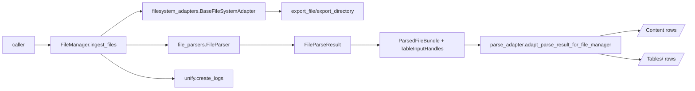

## Overview

`unity.file_manager` is the **durable file ingestion subsystem**. It is the place where:

- **Filesystem I/O** happens (`filesystem_adapters/`)
- **Parsing** happens (`file_parsers/`)
- **Parse → ingest adaptation** happens (`parse_adapter/`)
- **Ingestion + embedding orchestration** happens (`managers/`)

This module is designed for a distributed, tool-loop driven assistant: parsing and ingestion must be robust, typed, and observable.

## Core design goals

- **Strict typing at module boundaries**: Pydantic models and small stable enums
- **Separation of concerns**: adapters ≠ parser ≠ ingestion
- **Hot-swappable parsing backends**: registry + class-path mapping
- **Best-effort batch behavior**: per-file failures do not crash the whole run
- **No server-managed IDs client-side**: `file_id` / `row_id` are assigned by the server, not written by the client

## Canonical boundaries (the contracts that matter)

### Parser boundary (FileManager → FileParser)

- **Input**: `unity.file_manager.file_parsers.types.contracts.FileParseRequest`
  - `logical_path`: stable external identifier (adapter path)
  - `source_local_path`: actual local file path to read (may be a temp export)
- **Output**: `unity.file_manager.file_parsers.types.contracts.FileParseResult`
  - Must be format-aware (CSV/XLSX vs PDF/DOCX/TXT) and include `trace`

### Ingestion boundary (FileManager → Unify contexts)

- **FileRecords index rows**: `unity.file_manager.types.file.FileRecordRow`
- **/Content rows**: `unity.file_manager.types.file.FileContentRow`
- **/Tables/<label> rows**: raw JSON rows from `ExtractedTable.rows`

Important invariant: `/Content/` is the *navigation + retrieval* surface. Raw tabular data is stored under `/Tables/<label>`; `/Content/` rows should not embed large table/sheet payloads.

## Directory taxonomy

- `filesystem_adapters/`: thin synchronous adapters around concrete file stores (local FS)
- `file_parsers/`: format-aware parsing subsystem. Input is `FileParseRequest`, output is `FileParseResult`.
- `parse_adapter/`: FileManager-owned transformation of parse artifacts into ingestion payloads (lowering) and row streaming dispatch.
- `managers/`: orchestration (export files, parse, ingest rows, embed) and background attachment ingestion.
- `pipeline/`: shared pipeline infrastructure — typed transport models, artifact store, work queues, resilience, observability/cost ledgers, and deployment bundle ingestion.
- `types/`: pipeline config + typed row models used at the ingestion boundary.

## End-to-end flow

### Direct ingestion (FileManager.ingest_files)



### Background attachment ingestion (conversation attachments)

When a comms adapter delivers an attachment, it is saved to disk and ingestion is dispatched to a background `AttachmentIngestionPool`:

```
comms adapter event → save_attachment(auto_ingest=False)
  → enqueue_attachment_ingestion(file_manager, paths)
    → AttachmentIngestionPool (ThreadPoolExecutor)
      → FileRecords status: queued → ingesting → success/error
```

The conversation pod continues immediately. Ingestion status is tracked on `FileRecordFields.ingestion_status` and surfaced through the `describe()` method.

### Offline deployment bundle ingestion

For client data dumps, see [`pipeline/deployment/README.md`](pipeline/deployment/README.md). The flow is:

```
DeploymentBundle → prepare_bundle() → submit() → execute callback → job status
```

## Extensibility & guidelines

### Adding a filesystem adapter

Implement `filesystem_adapters.BaseFileSystemAdapter` and return `FileReference` objects with stable identity:

- `FileReference.path`: becomes the **logical path** used for contexts/records.
- `FileReference.uri`: optional but preferred canonical provider URI (e.g., `local:///abs/path`, `gdrive://fileId`).

Adapters should be thin: no parsing, no LLM usage, no ingestion logic.

### Adding or swapping a parser backend

1. Implement a backend subclassing `file_parsers.types.backend.BaseFileParserBackend` under:
   - `file_parsers/implementations/<impl>/backends/`
2. Register it in `file_parsers/registry.py` (`DEFAULT_BACKEND_CLASS_PATHS_BY_FORMAT`) or override per-call via config.
3. Add tests under `tests/file_manager/file_parser/`.

### Changing how parse results are lowered

The parser must stay ingestion-agnostic. If you need to change `/Content/` row shapes or rules:

- update FileManager-owned row models in `types/file.py`
- update lowering logic in `parse_adapter/lowering/`

## Testing strategy

File-manager parsing tests live under:

- `tests/file_manager/file_parser/` — parser backend and streaming tests
- `tests/file_manager/managers/` — FileManager integration tests
- `tests/file_manager/test_deployment_bundle.py` — deployment bundle stores, runner, and queue coordinator
- `tests/file_manager/test_work_queue.py` — work queue protocol and local implementation
- `tests/conversation_manager/core/test_attachment_ingestion.py` — background attachment ingestion lifecycle

Use the sample fixtures under:

- `tests/file_manager/sample/`

Avoid writing tests against deprecated legacy parser modules; new work should target the `FileParseRequest → FileParseResult` boundary, the `parse_adapter` lowering rules, and the `pipeline/` infrastructure.
